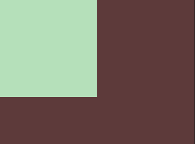

<header>
    <h1>CSS Coding-Challange 1</h1>
</header>

<h1>Basics </h1>
<p>
    This is in regards of the first Coding-Challange. <br>
    The given base code (Picture 1) should be modified that we get the result from Picture 2.
</p>

<table>
  <tr>
    <td>
      
      <p align="center"><b>Picture 1: current state</b></p>
    </td>
    <td>
      
      <p align="center"><b>Picture 2: result state</b></p>
    </td>
  </tr>
</table>

**Current state code:**

```html
<div></div>
<style>
  div {
    width: 100px;
    height: 100px;
    background: #dd6b4d;
  }
</style>
```

**Result state code:** <br>
That is an example solution for the challange. Of cause there are more than one correct solution.

```html
<div></div>
<style>
  body {
    background: #5d3a3a;
    margin: 0;
  }
  div {
    width: 200px;
    height: 200px;
    background: #b5e0ba;
  }
</style>
```

<h1>Shortening of the Code </h1>

Within this challange you could see that on this challange the first place only used 54 characters for the code <br>

In regards of that i asked Claude how far the Solution can be reduced.

I decided to go with this solution which claude gave me:

```html
<p><style>*{margin:0;background:#5d3a3a}p{width:200;height:200;background:#b5e0ba
```

The solution is 81 characters long. Means we got not the 54 like from the winner but we got pretty close to it.

I also asked to explain the code so it is understandable.

## Beginner-Friendly Explanation

Let me explain this code like you're brand new to HTML/CSS:

```html
<p><style>*{margin:0;background:#5d3a3a}p{width:200;height:200;background:#b5e0ba
```

---

### **Part 1: The HTML**

**`<p>`**

This creates a **paragraph** element. Think of it like placing an invisible box on your page. Normally you'd use this for text, but here we're using it as a colored square!

Why use `<p>` instead of `<div>`? Just because it's shorter to type. In CSS Battle, shorter = better score!

---

**`<style>`**

This tells the browser: "Hey, the CSS styling rules are starting now!" Everything after this (until the browser figures out it's done) is CSS, not HTML.

---

### **Part 2: The CSS (Styling Rules)**

CSS works like this: **selector { property: value; }**

Think of it as: "**Who** gets styled { **what** should change: **how** it changes }"

---

**Rule #1: `*{margin:0;background:#5d3a3a}`**

Let's break this down:

- **`*`** = "Select EVERYTHING on the page"
  - The asterisk means "all elements" - the `<html>`, the `<body>`, and our `<p>`
- **`margin:0`** = "Remove all spacing around elements"
  - Browsers add default spacing (margins) around elements. This removes it so everything starts at the very edge of the screen with no gaps.
- **`background:#5d3a3a`** = "Make the background this color"
  - `#5d3a3a` is a hex code (a way to specify colors). This one is that dark brownish color.
  - Since we're applying this to EVERYTHING (`*`), the whole page becomes dark brown.

**Result:** The entire page is now dark brown with no gaps/spacing.

---

**Rule #2: `p{width:200;height:200;background:#b5e0ba`**

- **`p`** = "Select the paragraph element"
  - This specifically targets our `<p>` tag we created earlier.
- **`width:200`** = "Make it 200 pixels wide"
  - Normally you write `200px`, but CSS Battle lets you skip the `px` to save characters!
  - 200 pixels is about this wide on your screen: |————————|
- **`height:200`** = "Make it 200 pixels tall"
  - Same as width - creates a 200x200 square.
- **`background:#b5e0ba`** = "Make the background this color"
  - `#b5e0ba` is that light green color.
  - This OVERRIDES the dark brown we set earlier, but ONLY for the `<p>` element.

**Result:** Our `<p>` element becomes a 200x200 pixel light green square.

---

### **How It All Works Together:**

1. **Start with dark brown everywhere** (from the `*` rule)
2. **Place a light green square on top** (the `<p>` element styled by the second rule)
3. **The square sits in the top-left corner** (because we removed all margins)

---

### **Visual Analogy:**

Imagine you're painting:

1. **Paint the entire canvas dark brown** (`*` selector)
2. **Put a 200x200 light green sticker in the top-left corner** (`p` selector)

The green sticker sits ON TOP of the brown paint, covering it in that one spot!

---

### **Why Does the `<p>` Override the `*`?**

This is called **CSS Specificity** - basically, more specific rules win.

- `*` means "everything" (very general)
- `p` means "specifically paragraph elements" (more specific)

When both rules try to set a background color, the more specific one (`p`) wins for that element. So the `<p>` gets light green, while everything else stays dark brown.

### Why Can We Leave Out Closing Tags?

**Short answer:** Browsers are _really_ forgiving and try their best to understand "broken" HTML.

**Longer explanation:**

HTML was designed in the early days of the web when people hand-wrote code and made mistakes all the time. So browsers have built-in "repair" systems that try to figure out what you meant, even if your code isn't perfect.

When the browser sees:

```html
<p><style>*{...}
```

It thinks: "Okay, there's a `<p>` tag, then a `<style>` tag starts... when does the style tag end? Oh, the document ended, so that must be where it ends!"

**Important:** This is **NOT good practice** for real websites! In real projects, you should always close your tags properly. But in CSS Battle code golf, where the only goal is fewest characters, people exploit this browser forgiveness.

Think of it like texting - you might write "gonna" instead of "going to" to a friend, but you wouldn't do that in a job application. CSS Battle is the "texting" version of coding!

---

That is all to that.
I hope it helps <3
