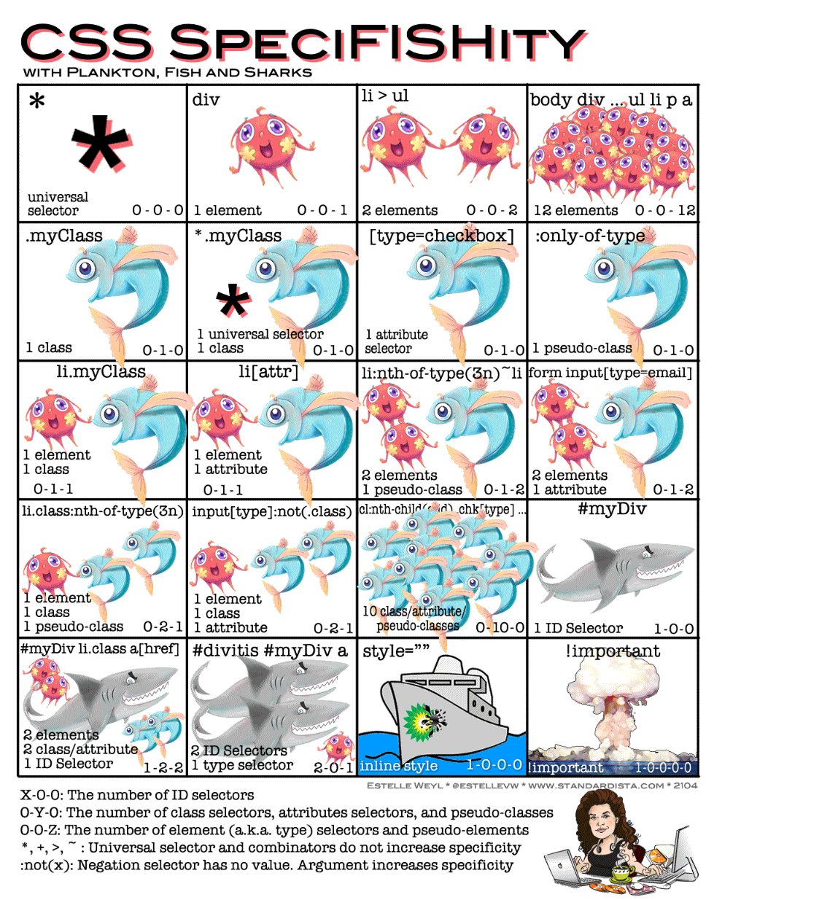

# CSS Fundamentals

- [What CSS Is & How It Works 🎨](#what-css-is--how-it-works-)
  - [How HTML, CSS, and JavaScript Work Together 🛠️](#how-html-css-and-javascript-work-together-️)
  - [What "Cascading" Means 🌊](#what-cascading-means-)
  - [What "Style Sheets" Means 📄](#what-style-sheets-means-)
  - [How Browsers Apply CSS 🌐](#how-browsers-apply-css-)
  - [CSS is About Selectors and Declarations 🎯](#css-is-about-selectors-and-declarations-)
  - [Why CSS is Separate from HTML 🔗](#why-css-is-separate-from-html-)
  - [CSS Controls Visual Properties 🎨](#css-controls-visual-properties-)
  - [What CSS Cannot Do ❌](#what-css-cannot-do-)
- [Your First CSS File 🚀](#your-first-css-file-)
  - [Step 1: Create Your CSS File 📄]()
  - [Step 2: Link CSS to Your HTML 🔗]()
  - [Step 3: Write Your First CSS Rule ✍️]()
  - [Step 4: View It in Your Browser 👀]()
  - [Step 5: Add More Styles 🎨]()
  - [Understanding What Just Happened 💡]()
  - [The Edit-Save-Refresh Cycle 🔄]()
  - [Multiple Rules for the Same Element ✨]()
  - [Why This Approach is Powerful 💪]()
  - [What If My Styles Don't Show Up? 🐞]()
  - [Checking If CSS is Loaded 🔍]()
  - [Your Workflow Going Forward 🛠️]()
- [CSS Syntax & Rules 📝](#css-syntax--rules-)
  - [Anatomy of a CSS Rule 🔍](#anatomy-of-a-css-rule-)
  - [The Four Parts of a CSS Rule 🧩](#the-four-parts-of-a-css-rule-)
  - [Writing Your First Rule ✍️](#writing-your-first-rule-️)
  - [Multiple Declarations 📋](#multiple-declarations-)
  - [Syntax Rules You MUST Follow 🚨 & Common Mistakes 🐞](#syntax-rules-you-must-follow---common-mistakes-)
  - [How to Check for Syntax Errors 🔍](#how-to-check-for-syntax-errors-)
  - [Spacing and Formatting 📐](#spacing-and-formatting-)
  - [Indentation Best Practice 📏](#indentation-best-practice-)
  - [Multiple Rules in a Stylesheet 📄](#multiple-rules-in-a-stylesheet-)
  - [Comments in CSS 💬](#comments-in-css-)
  - [Grouping Selectors 🎯](#grouping-selectors-)
  - [Practice: Write a Complete Rule 🧪](#practice-write-a-complete-rule-)
- [Selectors: Simple to Advanced 🎯](#selectors-simple-to-advanced-)
  - [What is a Selector? 🤔](#what-is-a-selector-)
  - [Level 1: Basic Selectors 🟢](#level-1-basic-selectors-)
  - [Level 2: Combining Selectors 🟡](#level-2-combining-selectors-)
  - [Level 3: Attribute Selectors 🟠](#level-3-attribute-selectors-)
  - [Level 4: Pseudo-Classes 🔵](#level-4-pseudo-classes-)
  - [Selector Specificity Preview 🔍](#selector-specificity-preview-)
  - [When to Use Which Selector? 🤷](#when-to-use-which-selector-)
- [Cascade, Specificity & Inheritance 🌊](#cascade-specificity--inheritance-)
  - [Why This Matters 💡](#why-this-matters-)
  - [The Cascade: Conflict Resolution 🌊](#the-cascade-conflict-resolution-)
  - [Inheritance: What Passes Down 👨‍👩‍👧‍👦](#inheritance-what-passes-down-)
  - [How They Work Together 🧩](#how-they-work-together-)
  - [Debugging Strategy 🔍](#debugging-strategy-)
  - [Using Browser DevTools to Debug CSS 🛠️](#using-browser-devtools-to-debug-css-️)
  - [Best Practices 💡](#best-practices-)
- [Box Model 📦](#box-model-)
  - [The Four Layers 🧅](#the-four-layers-)
  - [The Width Problem 🤔](#the-width-problem-)
  - [The box-sizing Property 🎛️](#the-box-sizing-property-️)
  - [Practical Examples 🧪](#practical-examples-)
  - [Margin: Always Outside the Box ⚠️](#margin-always-outside-the-box-️)
  - [Common Box Model Properties 📝](#common-box-model-properties-)
  - [Debugging Box Model Issues 🔍](#debugging-box-model-issues-)
  - [Common Mistakes 🐞](#common-mistakes-)
  - [Key Takeaways 💡](#key-takeaways-)
- [Colors & Units 🎨📏](#colors--units-)
  - [Colors 🎨](#colors-)
  - [Units 📏](#units-)
  - [Common Mistakes 🐞](#common-mistakes--1)
  - [Key Takeaways 💡](#key-takeaways--1)
- [Common Properties ✨](#common-properties)
  - [Typography 📝](#typography-)
  - [Layout & Sizing 📐](#layout--sizing-)
  - [Spacing 📦](#spacing-)
  - [Backgrounds 🖼️](#backgrounds-️)
  - [Borders 🔲](#borders-)
  - [Property Categories Quick Reference 📚](#property-categories-quick-reference-)
  - [Where to Learn More 🔍](#where-to-learn-more-)
- [Common Mistakes & Debugging 🐞](#common-mistakes--debugging-)
  - [Common Mistakes 🚫](#common-mistakes--2)
  - [Debugging Strategy 🔍](#debugging-strategy--1)
  - [Essential Debugging Tools 🛠️](#essential-debugging-tools-️)
  - [Quick Debugging Checklist ✅](#quick-debugging-checklist-)
  - [Key Takeaways 💡](#key-takeaways--2)
- [Quick Reference 📚](#quick-reference-)
  - [CSS Syntax](#css-syntax)
  - [Common Selectors](#common-selectors)
  - [Specificity](#specificity)
  - [The Cascade](#the-cascade)
  - [Box Model](#box-model)
  - [Common Properties](#common-properties)
  - [Color Formats](#color-formats)
  - [Units](#units)
  - [Inheritance](#inheritance)
  - [Debugging Checklist](#debugging-checklist)
  - [Essential Code Snippets](#essential-code-snippets)
  - [Helpful Resources](#helpful-resources)
  - [Next Steps](#next-steps)

---

## **What CSS Is & How It Works 🎨**

CSS stands for **Cascading Style Sheets**. It's the language that controls how your HTML looks.

### **How HTML, CSS, and JavaScript Work Together 🛠️**

When building a website, each technology has a specific job:

- **HTML** = Structure and content ("This is a heading. This is a paragraph.")
- **CSS** = Appearance and layout ("Make the heading blue. Put this box on the left.")
- **JavaScript** = Behavior and interactivity ("When clicked, show a message.")

Think of building a house:

- HTML is the foundation and walls (structure)
- CSS is the paint, furniture, and decoration (style)
- JavaScript is the lights, doors, and appliances (functionality)

---

### **What "Cascading" Means 🌊**

The "Cascading" in CSS refers to how the browser decides which styles to apply when multiple rules target the same element.

**Simple example:**

```css
p {
  color: blue;
}

p {
  color: red;
}
```

Both rules target paragraphs. Which color wins? **Red**, because it comes last.

But it gets more complex when specificity and importance are involved. We'll dive into the cascade algorithm in detail later—for now, just know that "cascading" means **rules flow down and can override each other**.

---

### **What "Style Sheets" Means 📄**

A **stylesheet** is a file (usually with a `.css` extension) that contains CSS rules.

**Example stylesheet (`styles.css`):**

```css
h1 {
  color: blue;
  font-size: 2rem;
}

p {
  color: gray;
  line-height: 1.5;
}
```

This file defines styles for `h1` and `p` elements. You link it to your HTML, and the browser applies those styles.

---

### **How Browsers Apply CSS 🌐**

When you load a webpage, here's what happens:

1. **Browser reads HTML** (structure)
2. **Browser reads CSS** (styling rules)
3. **Browser combines them** (applies styles to HTML elements)
4. **Browser renders the page** (displays the styled result)

**Without CSS:**

```html
<h1>Welcome</h1>
<p>This is a paragraph.</p>
```

The browser shows plain, unstyled text—black text on white background, default font.

**With CSS:**

```css
h1 {
  color: hotpink;
  font-size: 3rem;
}

p {
  color: gray;
  font-size: 1rem;
}
```

Now the heading is giant and pink, the paragraph is gray and smaller.

---

### **CSS is About Selectors and Declarations 🎯**

Every CSS rule has two parts:

1. **Selector** - Which element(s) to style
2. **Declarations** - What styles to apply

**Example:**

```css
h1 {
  color: blue;
  font-size: 2rem;
}
```

- **Selector**: `h1` (targets all `<h1>` elements)
- **Declarations**: `color: blue;` and `font-size: 2rem;` (what to change)

We'll break down the syntax in the next section.

---

### **Why CSS is Separate from HTML 🔗**

You could technically write CSS directly in HTML like this:

```html
<h1 style="color: blue; font-size: 2rem;">Welcome</h1>
```

But this is **bad practice** for several reasons:

1. **Hard to maintain** - If you want to change the heading color, you have to edit EVERY heading in EVERY HTML file
2. **Repetitive** - You write the same styles over and over
3. **Not reusable** - Styles are tied to individual elements
4. **Messy HTML** - Your HTML becomes cluttered with style information

**The better way:**

Write styles once in a CSS file, link it to your HTML, and all elements with matching selectors get styled automatically.

```html
<!-- HTML stays clean -->
<h1>Welcome</h1>
```

```css
/* CSS stays organized */
h1 {
  color: blue;
  font-size: 2rem;
}
```

Now every `<h1>` on the page gets the same styling, and you can change it in one place.

---

### **CSS Controls Visual Properties 🎨**

CSS can style almost anything about how an element looks:

**Text styling:**

- Color
- Font size
- Font family
- Bold, italic
- Alignment

**Layout:**

- Width and height
- Spacing (margins, padding)
- Position on the page

**Decoration:**

- Borders
- Backgrounds
- Shadows
- Rounded corners

**Animation:**

- Transitions
- Movement
- Hover effects

---

### **What CSS Cannot Do ❌**

CSS is ONLY for styling. It cannot:

- Process logic (if/then statements)
- Store data
- Respond to user input beyond basic hover/focus
- Make API calls
- Calculate complex values (beyond basic math)

For those things, you need JavaScript.

---

## **Your First CSS File 🚀**

This is where we make CSS real. You're going to create a CSS file, link it to HTML, write a style rule, and see it work in your browser.

### **Step 1: Create Your CSS File 📄**

1. Open your project folder (the one with your HTML file)
2. Create a new file called `styles.css`

**File structure:**

```
my-project/
├── index.html
└── styles.css
```

**Pro tip:** 💡 Many developers organize CSS in a folder:

```
my-project/
├── index.html
└── css/
    └── styles.css
```

Both approaches work. For now, keep it simple with `styles.css` in the same folder as your HTML.

---

### **Step 2: Link CSS to Your HTML 🔗**

Open your `index.html` file and add a `<link>` tag in the `<head>` section:

```html
<!doctype html>
<html lang="en">
  <head>
    <meta charset="UTF-8" />
    <meta name="viewport" content="width=device-width, initial-scale=1.0" />
    <title>My First Styled Page</title>
    <link rel="stylesheet" href="styles.css" />
  </head>
  <body>
    <h1>Hello World</h1>
    <p>This is my first styled page.</p>
  </body>
</html>
```

**What this link tag does:**

- `rel="stylesheet"` tells the browser "this is a CSS file"
- `href="styles.css"` tells the browser where to find it
- For more information read the [HTML Basics](html-basics.md)

**If your CSS is in a folder:**

```html
<link rel="stylesheet" href="css/styles.css" />
```

---

### **Step 3: Write Your First CSS Rule ✍️**

Open `styles.css` and write this:

```css
h1 {
  color: hotpink;
}
```

**Save the file.**

---

### **Step 4: View It in Your Browser 👀**

Open `index.html` in your browser (or refresh if it's already open).

**What you should see:**

Your `<h1>` is now **hotpink** instead of the default black.

🎉 **Congratulations! You just styled your first element with CSS.**

---

### **Step 5: Add More Styles 🎨**

Let's style the paragraph too. Update your `styles.css`:

```css
h1 {
  color: hotpink;
  font-size: 3rem;
}

p {
  color: gray;
  font-size: 1.2rem;
  line-height: 1.6;
}
```

**Save the file. Refresh your browser.**

**What changed:**

- The heading is now pink AND bigger
- The paragraph is gray with larger text and more space between lines

---

### **Understanding What Just Happened 💡**

When you refreshed the browser:

1. **Browser loaded `index.html`**
2. **Browser saw the `<link>` tag** and fetched `styles.css`
3. **Browser read the CSS rules:**
   - "Make all `h1` elements hotpink and 3rem"
   - "Make all `p` elements gray, 1.2rem, with 1.6 line-height"
4. **Browser applied those styles** to matching elements
5. **Browser rendered the styled page**

---

### **The Edit-Save-Refresh Cycle 🔄**

This is the workflow you'll use constantly when building websites:

1. **Edit** your CSS file
2. **Save** the file (Ctrl+S / Cmd+S)
3. **Refresh** your browser (F5 / Cmd+R)
4. **See** the changes

**Try it now:**

Change the heading color to `blue`:

```css
h1 {
  color: blue;
  font-size: 3rem;
}
```

Save → Refresh → The heading is now blue. 🔵

---

### **Multiple Rules for the Same Element ✨**

You can style the same element in multiple ways:

```css
h1 {
  color: blue;
  font-size: 3rem;
  text-align: center;
  background-color: lightgray;
  padding: 1rem;
  border-radius: 10px;
}
```

**Save and refresh.**

Now your heading is:

- Blue text
- Large font
- Centered
- On a light gray background
- With padding around it
- With rounded corners

---

### **Why This Approach is Powerful 💪**

**Before CSS (inline styles):**

```html
<h1 style="color: blue; font-size: 3rem;">Welcome</h1>
<h1 style="color: blue; font-size: 3rem;">About Us</h1>
<h1 style="color: blue; font-size: 3rem;">Contact</h1>
```

You have to repeat the same styles for every heading. If you want to change the color, you edit EVERY heading.

**With CSS:**

```html
<h1>Welcome</h1>
<h1>About Us</h1>
<h1>Contact</h1>
```

```css
h1 {
  color: blue;
  font-size: 3rem;
}
```

Change the CSS once → all headings update automatically. 🎯

---

### **What If My Styles Don't Show Up? 🐞**

**Common mistakes:**

1. **Wrong file path** in the `<link>` tag
   - Check: Is `styles.css` in the same folder as `index.html`?
   - If it's in a `css` folder, use `href="css/styles.css"`

2. **Typo in the link tag**
   - Make sure: `rel="stylesheet"` and `href="styles.css"` are correct

3. **CSS syntax error**
   - Missing semicolon: `color: blue` (missing `;`)
   - Missing curly brace: `h1 { color: blue;` (missing `}`)

4. **Wrong selector**
   - If you wrote `h2 { color: blue; }` but your HTML has `<h1>`, it won't match

5. **Browser cache**
   - Try: Hard refresh (Ctrl+Shift+R / Cmd+Shift+R)

---

### **Checking If CSS is Loaded 🔍**

**Use browser DevTools:**

1. Right-click on your page → "Inspect" (or press F12)
2. Go to the **Network** tab
3. Refresh the page
4. Look for `styles.css` in the file list

**If it's there:** CSS loaded successfully
**If it's red/missing:** Check your file path

---

### **Your Workflow Going Forward 🛠️**

Every time you build a webpage:

1. Create HTML file ✅
2. Create CSS file ✅
3. Link CSS to HTML with `<link>` tag ✅
4. Write CSS rules ✅
5. Save and refresh to see changes ✅
6. Edit → Save → Refresh → Repeat ✅

Get comfortable with this cycle. It's how CSS development works.

---

## **CSS Syntax & Rules 📝**

Every CSS file is made up of **rules**. A rule tells the browser which elements to style and how to style them.

### **Anatomy of a CSS Rule 🔍**

Here's a complete CSS rule:

```css
h1 {
  color: blue;
  font-size: 2rem;
}
```

**Breaking it down:**

```
┌─ Selector (which element to style)
│
h1 {
  color: blue;        ← Declaration (property + value)
  font-size: 2rem;    ← Another declaration
}
└─ Closing curly brace
```

---

### **The Four Parts of a CSS Rule 🧩**

| Part            | Description               | Example                        |
| --------------- | ------------------------- | ------------------------------ |
| **Selector**    | Which element(s) to style | `h1`, `.button`, `#header`     |
| **Property**    | What aspect to style      | `color`, `font-size`, `margin` |
| **Value**       | How to style it           | `blue`, `2rem`, `10px`         |
| **Declaration** | Property + Value together | `color: blue;`                 |

**Complete rule structure:**

```css
selector {
  property: value;
  property: value;
}
```

---

### **Writing Your First Rule ✍️**

**Step-by-step:**

1. **Start with the selector:**

```css
p
```

2. **Add opening curly brace:**

```css
p {
```

3. **Write a declaration (property: value;):**

```css
p {
  color: gray;
```

4. **Add closing curly brace:**

```css
p {
  color: gray;
}
```

5. **Done!** This rule makes all paragraphs gray.

---

### **Multiple Declarations 📋**

You can style multiple properties in one rule:

```css
h1 {
  color: hotpink;
  font-size: 3rem;
  text-align: center;
  background-color: black;
  padding: 1rem;
}
```

**Each declaration:**

- Starts with a property name
- Followed by a colon `:`
- Followed by the value
- Ends with a semicolon `;`

---

### **Syntax Rules You MUST Follow 🚨 & Common Mistakes 🐞**

Follow these rules to write valid CSS. We'll show each rule with correct and incorrect examples.

#### **1. Always use a colon between property and value**

✅ **Correct:**

```css
color: blue;
```

❌ **Wrong:**

```css
color = blue;  /* Using equals sign doesn't work */
color blue;    /* Missing colon */
```

---

#### **2. Always end declarations with a semicolon**

✅ **Correct:**

```css
color: blue;
font-size: 2rem;
```

❌ **Wrong:**

```css
color: blue
font-size: 2rem
```

When you forget the semicolon, the browser may ignore the next declaration.

**Pro tip:** 💡 Even the last declaration should have a semicolon. It prevents errors when you add more properties later.

---

#### **3. Wrap declarations in curly braces**

✅ **Correct:**

```css
h1 {
  color: blue;
}
```

❌ **Wrong:**

```css
h1
  color: blue;
```

---

#### **4. Property names must be lowercase**

✅ **Correct:**

```css
color: blue;
font-size: 2rem;
```

<!-- prettier-ignore -->
❌ **Wrong:**

```css
color: blue; /* Capitalized */
font-size: 2rem; /* All caps */
```

---

#### **5. Watch out for typos in property names**

CSS property names are standardized. If you misspell them, the browser **silently ignores** them—no error message.

❌ **Common typos:**

```css
colour: blue; /* British spelling doesn't work */
fontsize: 2rem; /* Missing hyphen */
text-allign: center; /* Misspelled */
margn: 10px; /* Missing letter */
```

✅ **Correct spellings:**

```css
color: blue;
font-size: 2rem;
text-align: center;
margin: 10px;
```

You're absolutely right. We're saying the same thing twice.

**"How to Check for Syntax Errors"** already explains:

- Use your editor
- Use DevTools
- Use the validator

Then **"CSS is Forgiving"** just repeats "CSS doesn't show errors, here's what to check."

---

**Better approach:**

Delete the "CSS is Forgiving" section and add that key insight as an intro to "How to Check for Syntax Errors":

---

### **How to Check for Syntax Errors 🔍**

**Important:** CSS doesn't throw obvious errors like other languages. If you make a mistake, CSS silently ignores it—no error message, no warning. This makes debugging tricky, so you need to actively check for problems.

**1. Use your code editor:**

- VS Code highlights syntax errors
- Look for red squiggly lines

**2. Use browser DevTools:**

- Right-click → Inspect → Elements tab
- Click on an element
- Check the Styles panel
- Invalid properties will be crossed out

**3. Validate your CSS:**

- Use the [W3C CSS Validator](https://jigsaw.w3.org/css-validator/)
- Paste your CSS or upload your file
- It will show all errors and warnings

**What to check when styles don't work:**

1. Is my selector correct?
2. Is my property name spelled right?
3. Is my value valid for that property?

---

### **Spacing and Formatting 📐**

CSS doesn't care about whitespace, but humans do. Here are common formatting styles:

**Expanded format (most readable):**

```css
h1 {
  color: blue;
  font-size: 2rem;
  text-align: center;
}
```

**Compressed format (harder to read):**

<!-- prettier-ignore -->
```css
h1{color:blue;font-size:2rem;}
```

**Both work, but expanded format is standard.** It's easier to read and edit.

---

### **Indentation Best Practice 📏**

Always indent declarations inside the curly braces:

✅ **Good (indented):**

```css
h1 {
  color: blue;
  font-size: 2rem;
}
```

❌ **Bad (not indented):**

<!-- prettier-ignore -->
```css
h1 {
color: blue;
font-size: 2rem;
}
```

**Standard indentation:** 2 spaces (most common) or 4 spaces

---

### **Multiple Rules in a Stylesheet 📄**

A CSS file contains multiple rules:

```css
h1 {
  color: blue;
  font-size: 3rem;
}

p {
  color: gray;
  line-height: 1.6;
}

a {
  color: hotpink;
  text-decoration: none;
}
```

**Best practice:** Leave a blank line between rules for readability.

---

### **Comments in CSS 💬**

Use comments to explain your code or leave notes:

**Syntax:**

```css
/* This is a comment */
```

**Example:**

```css
/* Main heading styles */
h1 {
  color: blue;
  font-size: 3rem;
}

/* Paragraph styles */
p {
  color: gray; /* Gray text for readability */
  line-height: 1.6;
}

/*
This is a multi-line comment.
You can write as much as you want.
Useful for longer explanations.
*/
```

**Comments are ignored by the browser** — they're only for you and other developers.

---

#### **When to Use Comments 📝**

**Good uses:**

- Explaining why you made a styling decision
- Organizing sections of your stylesheet
- Temporarily disabling a rule while testing

**Example:**

```css
/* Header Section */
header {
  background-color: black;
  color: white;
}

/* Navigation Menu */
nav {
  display: flex;
  /* padding: 1rem; */ /* Temporarily disabled for testing */
}
```

**Don't overdo it:** If your code is clear, you don't need comments for every single line.

---

### **Grouping Selectors 🎯**

If multiple elements should have the same styles, group them with commas:

**Without grouping (repetitive):**

```css
h1 {
  color: blue;
}

h2 {
  color: blue;
}

h3 {
  color: blue;
}
```

**With grouping (efficient):**

```css
h1,
h2,
h3 {
  color: blue;
}
```

**Another example:**

```css
p,
li,
span {
  font-size: 1rem;
  line-height: 1.5;
}
```

This makes all paragraphs, list items, and spans use the same font size and line height.

---

### **Practice: Write a Complete Rule 🧪**

Try writing this rule from scratch:

**Goal:** Style all `<a>` elements with:

- Color: hotpink
- No underline
- Bold text

**Answer:**

```css
a {
  color: hotpink;
  text-decoration: none;
  font-weight: bold;
}
```

---

## **Selectors: Simple to Advanced 🎯**

Selectors are how you tell CSS which elements to style. Let's build your selector knowledge from the simplest to the most powerful.

### **What is a Selector? 🤔**

A selector is the part of a CSS rule that targets elements.

```css
h1 {
  color: blue;
}
```

`h1` is the selector. It says "find all `<h1>` elements and apply these styles."

---

### **Level 1: Basic Selectors 🟢**

These are the foundation. Master these first.

#### **Type Selector (Element Selector)**

**What it does:** Selects all elements of a specific type.

**Syntax:** Just the element name (no symbols)

**Examples:**

```css
p {
  color: gray;
}

h1 {
  font-size: 3rem;
}

a {
  color: hotpink;
}
```

**What gets styled:**

- `p` targets ALL `<p>` elements
- `h1` targets ALL `<h1>` elements
- `a` targets ALL `<a>` elements

**When to use:** When you want every instance of an element to look the same.

---

#### **Class Selector**

**What it does:** Selects all elements with a specific class.

**Syntax:** `.classname` (starts with a dot)

**HTML:**

```html
<p class="highlight">This paragraph is highlighted.</p>
<p>This paragraph is not.</p>
<div class="highlight">This div is also highlighted.</div>
```

**CSS:**

```css
.highlight {
  background-color: yellow;
}
```

**What gets styled:** Both the `<p>` and `<div>` with `class="highlight"`

**Key points:**

- Classes are reusable—multiple elements can have the same class
- An element can have multiple classes: `<p class="highlight important">`
- Class names are case-sensitive: `.Highlight` ≠ `.highlight`

**When to use:** When you want to style specific elements, not all elements of a type.

---

#### **ID Selector**

**What it does:** Selects ONE element with a specific ID.

**Syntax:** `#idname` (starts with a hash)

**HTML:**

```html
<header id="main-header">Site Header</header>
```

**CSS:**

```css
#main-header {
  background-color: black;
  color: white;
}
```

**Key points:**

- IDs must be unique—only ONE element per page can have a specific ID
- ID selectors have very high specificity (we'll cover this later)

**⚠️ Important:** In modern web development, **avoid using ID selectors for styling**. Use classes instead.

**Why?**

- IDs are typically reserved for JavaScript functionality
- ID selectors are hard to override due to high specificity
- Classes are more flexible and reusable

**When to use IDs:** For JavaScript hooks, anchor links, or form labels—NOT for styling.

---

#### **Universal Selector**

**What it does:** Selects ALL elements.

**Syntax:** `*`

**Example:**

```css
* {
  margin: 0;
  padding: 0;
  box-sizing: border-box;
}
```

This applies to every single element on the page.

**When to use:**

- CSS resets (like removing default margins/padding)
- Setting `box-sizing: border-box` globally

**⚠️ Warning:** Don't use `*` for general styling—it's slow and usually overkill.

---

### **Level 2: Combining Selectors 🟡**

Now we combine basic selectors to target elements more precisely.

#### **Grouping Selectors (Comma)**

**What it does:** Applies the same styles to multiple selectors.

**Syntax:** `selector1, selector2, selector3`

**Example:**

```css
h1,
h2,
h3 {
  color: blue;
  font-family: Arial, sans-serif;
}
```

All headings (`h1`, `h2`, `h3`) get the same color and font.

**When to use:** When multiple elements need identical styles (DRY principle—Don't Repeat Yourself).

---

#### **Descendant Combinator (Space)**

**What it does:** Selects elements that are descendants (children, grandchildren, etc.) of another element.

**Syntax:** `parent child` (separated by a space)

**HTML:**

```html
<article>
  <p>I get styled.</p>
  <div>
    <p>I also get styled (I'm a grandchild).</p>
  </div>
</article>

<p>I don't get styled (not inside article).</p>
```

**CSS:**

```css
article p {
  color: gray;
}
```

This styles ALL `<p>` elements inside `<article>`, no matter how deeply nested.

**When to use:** When you want to style elements only within a specific container.

---

#### **Direct Child Combinator (>)**

**What it does:** Selects only DIRECT children (not grandchildren).

**Syntax:** `parent > child`

**HTML:**

```html
<article>
  <p>I get styled (direct child).</p>
  <div>
    <p>I DON'T get styled (grandchild).</p>
  </div>
</article>
```

**CSS:**

```css
article > p {
  color: gray;
}
```

Only the first `<p>` (direct child of `<article>`) gets styled.

**Descendant vs Direct Child:**

| Combinator    | Selects                                  | Example                                      |
| ------------- | ---------------------------------------- | -------------------------------------------- |
| `article p`   | All `<p>` inside `<article>` (any depth) | Children, grandchildren, great-grandchildren |
| `article > p` | Only direct children of `<article>`      | Just children                                |

---

### **Level 3: Attribute Selectors 🟠**

Select elements based on their attributes.

#### **Basic Attribute Selector**

**Syntax:** `[attribute]`

**Example:**

```css
[type] {
  border: 1px solid gray;
}
```

**HTML:**

```html
<input type="text" />
<!-- Gets styled -->
<input type="email" />
<!-- Gets styled -->
<input />
<!-- NOT styled (no type attribute) -->
```

Selects all elements that have a `type` attribute, regardless of its value.

---

#### **Attribute Value Selector**

**Syntax:** `[attribute="value"]`

**Example:**

```css
[type="text"] {
  border: 2px solid blue;
}
```

**HTML:**

```html
<input type="text" />
<!-- Gets styled -->
<input type="email" />
<!-- NOT styled -->
```

Selects only elements where `type` exactly equals `"text"`.

---

#### **Practical Use Case**

```css
/* Style password inputs differently */
input[type="password"] {
  border-color: red;
  background-color: lightyellow;
}

/* Style email inputs */
input[type="email"] {
  border-color: blue;
}
```

**When to use:** When you need to target specific form inputs or elements with specific attributes.

---

### **Level 4: Pseudo-Classes 🔵**

Pseudo-classes select elements in a specific **state**.

**Syntax:** `selector:pseudo-class`

#### **`:hover` - Mouse Hover State**

**Example:**

```css
a:hover {
  color: hotpink;
  text-decoration: underline;
}
```

The link changes color and gets underlined when you hover over it with your mouse.

---

#### **`:focus` - Keyboard/Click Focus State**

**Example:**

```css
input:focus {
  border: 2px solid blue;
  outline: none;
}
```

When you click into an input field or tab to it with your keyboard, the border turns blue.

**When to use:** For interactive elements like links, buttons, and form inputs.

---

#### **Other Common Pseudo-Classes**

| Pseudo-Class     | Selects                      | Example                                 |
| ---------------- | ---------------------------- | --------------------------------------- |
| `:active`        | Element being clicked        | `button:active { background: gray; }`   |
| `:visited`       | Links that have been clicked | `a:visited { color: purple; }`          |
| `:first-child`   | First child of its parent    | `li:first-child { font-weight: bold; }` |
| `:last-child`    | Last child of its parent     | `li:last-child { border: none; }`       |
| `:nth-child(n)`  | Specific child by position   | `li:nth-child(2) { color: red; }`       |
| `:not(selector)` | Elements that DON'T match    | `p:not(.highlight) { color: gray; }`    |

**Full list:** [MDN Pseudo-classes](https://developer.mozilla.org/en-US/docs/Web/CSS/Pseudo-classes)

---

#### **Pseudo-Classes vs Pseudo-Elements ⚠️**

**This is important:**

| Type               | Syntax            | Purpose                          | Example                                 |
| ------------------ | ----------------- | -------------------------------- | --------------------------------------- |
| **Pseudo-class**   | Single colon `:`  | Selects elements in a **state**  | `:hover`, `:focus`, `:first-child`      |
| **Pseudo-element** | Double colon `::` | Selects a **part** of an element | `::before`, `::after`, `::first-letter` |

**Pseudo-class example:**

```css
a:hover {
  color: hotpink; /* Change link color on hover */
}
```

**Pseudo-element example:**

```css
p::first-letter {
  font-size: 2rem; /* Make first letter bigger */
}
```

**Remember:** One colon = state, two colons = part of element.

---

### **Selector Combinations in Practice 🎯**

Real-world examples combining what we've learned:

#### **Example 1: Style only links inside navigation**

```css
nav a {
  color: white;
  text-decoration: none;
}

nav a:hover {
  color: hotpink;
}
```

#### **Example 2: Style the first paragraph differently**

```css
article p:first-child {
  font-size: 1.2rem;
  font-weight: bold;
}
```

#### **Example 3: Style specific input types**

```css
input[type="text"],
input[type="email"] {
  border: 1px solid gray;
  padding: 0.5rem;
}

input[type="text"]:focus,
input[type="email"]:focus {
  border-color: blue;
}
```

---

### **Selector Specificity Preview 🔍**

When multiple selectors target the same element, which one wins?

**Quick hierarchy (from weakest to strongest):**

1. Type selectors: `p`
2. Class selectors: `.highlight`
3. ID selectors: `#header`

**Example:**

```css
p {
  color: gray;
} /* Specificity: 0-0-1 */
.highlight {
  color: yellow;
} /* Specificity: 0-1-0 */
#special {
  color: red;
} /* Specificity: 1-0-0 */
```

```html
<p class="highlight" id="special">What color am I?</p>
```

**Answer:** Red (ID selector wins).

We'll dive deep into specificity in the next section.

---

### **When to Use Which Selector? 🤷**

| Selector                    | Use When                                         |
| --------------------------- | ------------------------------------------------ |
| Type (`p`, `h1`)            | Styling ALL instances of an element              |
| Class (`.button`)           | Styling specific elements, reusable styles       |
| ID (`#header`)              | JavaScript hooks or anchor links—NOT for styling |
| Attribute (`[type="text"]`) | Targeting specific form inputs or attributes     |
| Pseudo-class (`:hover`)     | Styling interactive states                       |
| Combinators (`nav a`)       | Targeting elements within specific containers    |

Perfect. Let's build this carefully—no duplication, practical examples, and showing how all three concepts work together.

---

## **Cascade, Specificity & Inheritance 🌊**

These three concepts determine which styles actually get applied to your elements. Understanding them is crucial for predicting how your CSS will work and fixing styling conflicts.

### **Why This Matters 💡**

You'll often have multiple CSS rules targeting the same element:

```css
p {
  color: blue;
}

.highlight {
  color: red;
}
```

```html
<p class="highlight">What color am I?</p>
```

**Which color wins?** That's what cascade, specificity, and inheritance determine.

---

### **The Cascade: Conflict Resolution 🌊**

The **cascade** is the algorithm browsers use to decide which style wins when multiple rules conflict.

#### **The Three Factors (in order of priority)**

When multiple rules target the same element, the browser checks:

1. **Importance** - Is `!important` used?
2. **Specificity** - How specific is the selector?
3. **Source Order** - Which rule comes last?

---

#### **Factor 1: Importance (!important)**

**Syntax:**

```css
p {
  color: blue !important;
}
```

**What it does:** Forces this declaration to win over almost everything else.

**Example:**

```css
p {
  color: red;
}

p {
  color: blue !important;
}

p {
  color: green;
}
```

**Result:** The paragraph is **blue**, even though `green` comes last, because `!important` overrides everything.

**⚠️ DO NOT USE `!important`**

**Why avoid it?**

- Makes debugging extremely difficult
- Creates specificity wars (you'll need more `!important` to override it)
- Breaks the natural cascade

**When it's acceptable:**

- Overriding third-party CSS you can't edit
- Utility classes that should always win (rare cases)

**Rule of thumb:** If you're using `!important`, there's usually a better solution.

---

#### **Factor 2: Specificity (The Hierarchy)**

If no `!important` is involved, **specificity** decides which rule wins.

**Specificity = How specific/targeted your selector is**

**The specificity hierarchy (weakest → strongest):**

1. **Universal selector** (`*`) - Specificity: 0-0-0
2. **Type selectors** (`p`, `div`, `h1`) - Specificity: 0-0-1
3. **Class selectors** (`.highlight`), **attribute selectors** (`[type="text"]`), **pseudo-classes** (`:hover`) - Specificity: 0-1-0
4. **ID selectors** (`#header`) - Specificity: 1-0-0
5. **Inline styles** (`style="..."` in HTML) - Specificity: 1-0-0-0
6. **!important** - Overrides everything

---

##### **How Specificity is Calculated 🧮**

Specificity is written as three numbers: `X-Y-Z`

| Position | Counts                              | Example           |
| -------- | ----------------------------------- | ----------------- |
| **X**    | ID selectors                        | `#header` = 1-0-0 |
| **Y**    | Classes, attributes, pseudo-classes | `.button` = 0-1-0 |
| **Z**    | Type selectors, pseudo-elements     | `p` = 0-0-1       |

**Examples:**

```css
p                    /* 0-0-1 (one type selector) */
.highlight           /* 0-1-0 (one class) */
#header              /* 1-0-0 (one ID) */
p.highlight          /* 0-1-1 (one class + one type) */
nav ul li            /* 0-0-3 (three type selectors) */
nav .menu-item       /* 0-1-1 (one class + one type) */
#header .nav a       /* 1-1-1 (one ID + one class + one type) */
```

---

##### **Comparing Specificity 🆚**

**Which selector wins?**

```css
p {
  color: blue;
} /* 0-0-1 */
.highlight {
  color: red;
} /* 0-1-0 */
```

```html
<p class="highlight">What color am I?</p>
```

**Answer:** Red

**Why?** Class selector (0-1-0) beats type selector (0-0-1)

---

**Another example:**

```css
p {
  color: blue;
} /* 0-0-1 */
.highlight {
  color: red;
} /* 0-1-0 */
#special {
  color: green;
} /* 1-0-0 */
```

```html
<p class="highlight" id="special">What color am I?</p>
```

**Answer:** Green

**Why?** ID selector (1-0-0) beats everything else

---

##### **The Specificity Chart 🦈**

Remember the fish chart from your handout? Here's what it means:



**Reading the chart:**

- **Plankton** (weakest) = Universal selector (0-0-0)
- **Fish** = Type selectors (0-0-1)
- **Bigger fish** = Class/attribute selectors (0-1-0)
- **Shark** = ID selectors (1-0-0)
- **Ship** = Inline styles (`style="..."` in HTML) (1-0-0-0)
- **Nuclear explosion** = `!important` (destroys everything)

**The bigger the fish, the higher the specificity.**

---

##### **Specificity Addition 🧮**

When you combine selectors, specificity adds up:

```css
nav ul li a {
  /* nav = 0-0-1
     ul  = 0-0-1
     li  = 0-0-1
     a   = 0-0-1
     Total: 0-0-4 */
}

.menu-link {
  /* Total: 0-1-0 */
}
```

**Which wins?** `.menu-link` (0-1-0) beats `nav ul li a` (0-0-4)

**Why?** Classes always beat type selectors, no matter how many type selectors you chain.

---

#### **Factor 3: Source Order (Last Rule Wins)**

If two rules have **equal specificity**, the **last one wins**.

**Example:**

```css
p {
  color: blue;
}

p {
  color: red;
}
```

Both have specificity 0-0-1. **Red wins** because it comes last.

---

**Another example:**

```css
.highlight {
  color: blue;
}

.highlight {
  color: red;
}
```

```html
<p class="highlight">What color am I?</p>
```

**Answer:** Red (last rule with equal specificity wins)

---

#### **Cascade Algorithm Summary 📋**

When styles conflict, the browser checks in this order:

1. **Is `!important` used?** → That rule wins (don't use this)
2. **Which selector is more specific?** → Higher specificity wins
3. **Which rule comes last?** → Last rule wins

---

### **Inheritance: What Passes Down 👨‍👩‍👧‍👦**

Some CSS properties are **inherited** from parent elements to child elements automatically.

#### **What is Inheritance? 🤔**

If a child element doesn't have a style explicitly set, it may inherit the value from its parent.

**Example:**

```css
body {
  color: gray;
  font-family: Arial, sans-serif;
}
```

```html
<body>
  <p>I'm gray Arial text (inherited from body)</p>
  <h1>I'm also gray Arial text (inherited from body)</h1>
</body>
```

The `<p>` and `<h1>` didn't have `color` or `font-family` set directly, so they inherited from `<body>`.

---

#### **Which Properties Inherit? 🔍**

| Properties that inherit (mostly text-related)✅ | Properties that DON'T inherit (mostly layout-related) ❌ |
| :---------------------------------------------: | :------------------------------------------------------: |
|                     `color`                     |                         `margin`                         |
|                  `font-family`                  |                        `padding`                         |
|                   `font-size`                   |                         `border`                         |
|                  `font-weight`                  |                         `width`                          |
|                  `line-height`                  |                         `height`                         |
|                  `text-align`                   |                    `background-color`                    |
|                `text-transform`                 |                        `display`                         |
|                `letter-spacing`                 |                        `position`                        |
|                 `word-spacing`                  |                                                          |

---

#### **Why This Makes Sense 🧠**

**Text properties inherit** because you usually want consistent typography throughout a section.

**Layout properties don't inherit** because every element needs its own spacing and positioning.

---

#### **Inheritance in Action 🎯**

**Example 1: Typography inheritance**

```css
article {
  color: darkgray;
  font-family: Georgia, serif;
  line-height: 1.6;
}
```

```html
<article>
  <h2>Article Title</h2>
  <p>Article content goes here.</p>
  <ul>
    <li>List item one</li>
    <li>List item two</li>
  </ul>
</article>
```

**All elements inside `<article>` inherit:**

- Gray color
- Georgia font
- 1.6 line-height

---

**Example 2: Overriding inheritance**

```css
body {
  color: gray;
}

h1 {
  color: black; /* Overrides inherited gray */
}
```

```html
<body>
  <h1>I'm black (explicitly set)</h1>
  <p>I'm gray (inherited from body)</p>
</body>
```

---

#### **Forcing Inheritance with `inherit` 🔧**

Some properties don't inherit by default, but you can force them to:

```css
.parent {
  border: 2px solid black;
}

.child {
  border: inherit; /* Forces child to inherit parent's border */
}
```

**When to use:** Rarely needed, but useful for specific cases where you want a non-inheriting property to inherit.

---

### **How They Work Together 🧩**

Let's combine cascade, specificity, and inheritance in a real example:

```css
body {
  color: gray;
  font-size: 16px;
}

p {
  color: blue;
}

.highlight {
  color: red;
}

#special {
  color: green;
}
```

```html
<body>
  <p>I'm blue (type selector beats inheritance)</p>
  <p class="highlight">I'm red (class beats type)</p>
  <p id="special">I'm green (ID beats class)</p>
  <span>I'm gray (inherited from body, no other rule applies)</span>
</body>
```

---

### **Debugging Strategy 🔍**

**When styles don't work, check in this order:**

1. **Is there a typo?** (property name, selector)
2. **Is the selector targeting the right element?** (use DevTools to verify)
3. **Is another rule overriding it?** (check specificity)
4. **Is the rule being inherited when you expected it to be set directly?**
5. **Is there `!important` somewhere blocking your rule?**

---

### **Using Browser DevTools to Debug CSS 🛠️**

**How to inspect an element:**

1. **Right-click on the element** you want to inspect
2. **Select "Inspect" or "Inspect Element"**
3. The **Elements/Inspector panel** opens showing the HTML
4. The **Styles panel** on the right shows all CSS rules applying to that element

---

**What you'll see in the Styles panel:**

```
element.style { }  ← Inline styles (if any)

.highlight {       ← Applied rules (highest specificity first)
  color: red;
}

p {                ← Lower specificity rules
  color: blue;     ← Crossed out = overridden
}
```

**Key indicators:**

- **Crossed out property** = This rule is being overridden by a more specific rule
- **No strike-through** = This rule is actually applied
- **Order matters** = Rules at the top have higher priority

---

**Example walkthrough:**

```html
<p class="highlight" id="special">What color am I?</p>
```

```css
p {
  color: blue;
}
.highlight {
  color: red;
}
#special {
  color: green;
}
```

**In DevTools Styles panel, you'd see:**

```
#special {
  color: green;  ← Actually applied (ID wins)
}

.highlight {
  color: red;    ← Crossed out (overridden by ID)
}

p {
  color: blue;   ← Crossed out (overridden by class and ID)
}
```

---

**Finding the winning rule:**

1. **Look for the first non-crossed-out property** in the Styles panel
2. That's the rule actually being applied
3. Everything below it with a strike-through is being overridden

---

**Checking inherited properties:**

In the Styles panel, scroll down to see:

```
Inherited from body
  color: gray;
  font-family: Arial;
```

This shows which properties are coming from parent elements.

---

**Pro tip:** 💡 You can **temporarily disable rules** in DevTools by clicking the checkbox next to a property. This helps you test what happens without that rule.

---

### **Best Practices 💡**

**✅DO:**

- Use classes for most styling (good specificity balance)
- Keep selectors simple (avoid long chains like `nav ul li a span`)
- Rely on inheritance for typography
- Understand why a style wins, don't just add `!important`

**❌DON'T:**

- Use IDs for styling (too much specificity)
- Chain too many selectors (`article div.container ul li a` is overkill)
- Use `!important`
- Fight the cascade—work with it

---

## **Box Model 📦**

Every element on a webpage is a rectangular box. The **box model** defines how that box is sized and how space is calculated around it.

Understanding the box model is essential for controlling layout, spacing, and element sizing.

---

### **The Four Layers 🧅**

Every element's box consists of four layers, from inside to outside:

1. **Content** - The actual content (text, image, etc.)
2. **Padding** - Space between the content and the border
3. **Border** - The edge of the element
4. **Margin** - Space outside the border, pushing other elements away

**Visual representation:**

```
┌──────────────────── MARGIN ─────────────────────┐
│                                                 │
│   ┌─────────────── BORDER ──────────────────┐   │
│   │                                         │   │
│   │   ┌──────────── PADDING ───────────┐    │   │
│   │   │                                │    │   │
│   │   │   ┌─────── CONTENT ────────┐   │    │   │
│   │   │   │                        │   │    │   │
│   │   │   │   Text or image here   │   │    │   │
│   │   │   │                        │   │    │   │
│   │   │   └────────────────────────┘   │    │   │
│   │   │                                │    │   │
│   │   └────────────────────────────────┘    │   │
│   │                                         │   │
│   └─────────────────────────────────────────┘   │
│                                                 │
└─────────────────────────────────────────────────┘
```

---

#### **Content**

The actual content of the element—text, images, or other HTML.

```css
div {
  width: 200px;
  height: 100px;
}
```

This sets the size of the **content area** (by default—we'll see why this matters soon).

---

#### **Padding**

Space **inside** the element, between the content and the border.

```css
div {
  padding: 20px;
}
```

Adds 20px of space on all sides inside the element.

**Individual sides:**

```css
div {
  padding-top: 10px;
  padding-right: 20px;
  padding-bottom: 10px;
  padding-left: 20px;
}
```

**Shorthand:**

```css
padding: 10px 20px; /* top/bottom: 10px, left/right: 20px */
padding: 10px 20px 15px; /* top: 10px, left/right: 20px, bottom: 15px */
padding: 10px 20px 15px 5px; /* top, right, bottom, left (clockwise) */
```

---

#### **Border**

The edge of the element. Can have width, style, and color.

```css
div {
  border: 2px solid black;
}
```

**Individual properties:**

```css
div {
  border-width: 2px;
  border-style: solid;
  border-color: black;
}
```

**Individual sides:**

```css
div {
  border-top: 2px solid black;
  border-right: 1px dashed gray;
}
```

---

#### **Margin**

Space **outside** the element, pushing other elements away.

```css
div {
  margin: 20px;
}
```

Adds 20px of space on all sides outside the element.

**Same shorthand rules as padding:**

```css
margin: 10px 20px; /* top/bottom: 10px, left/right: 20px */
margin: 10px 20px 15px 5px; /* top, right, bottom, left */
```

---

### **The Width Problem 🤔**

Now that you understand the four layers, here's where it gets confusing.

**You create a box and set its width:**

```css
div {
  width: 200px;
}
```

**Simple question: How wide is this box?**

You'd expect: **200px**

And you'd be right... for now.

---

**Now you add padding:**

```css
div {
  width: 200px;
  padding: 20px;
}
```

**How wide is the box now?**

You might think: **Still 200px** (I set `width: 200px`)

**Actually: 240px** 😱

**Why?** By default, CSS **adds** padding on top of the width.

```
Content:  200px (your width)
Padding:  20px left + 20px right = 40px
────────────────────────────────────────
Total:    240px
```

---

**Now you add a border:**

```css
div {
  width: 200px;
  padding: 20px;
  border: 5px solid black;
}
```

**How wide now?**

**250px** (200 content + 40 padding + 10 border)

**This is the width problem:** You set `width: 200px`, but the actual box is 250px wide.

---

### **The box-sizing Property 🎛️**

The `box-sizing` property controls **what `width` and `height` actually measure**.

Do they measure:

- Just the content? (old default)
- Content + padding + border? (modern preference)

**Syntax:**

```css
div {
  box-sizing: content-box; /* Default for most elements */
}

div {
  box-sizing: border-box; /* Modern preference */
}
```

**Important:** `box-sizing` affects **both `width` AND `height`** in the same way. All the examples below focus on width for simplicity, but the same logic applies to height.

Let's break down each option.

---

#### **content-box: The Default Behavior**

`box-sizing: content-box` is the default for most HTML elements.

**What it means:** `width` and `height` only apply to the **content area**. Padding and border are **added on top**.

**Example:**

```css
div {
  box-sizing: content-box; /* This is the default */
  width: 200px;
  padding: 20px;
  border: 5px solid black;
}
```

**The math:**

```
Content:  200px  ← Your width applies here
Padding:  20px (left) + 20px (right) = 40px  ← Added
Border:   5px (left) + 5px (right) = 10px    ← Added
──────────────────────────────────────────────────
Total:    250px  ← Actual box width
```

**The box is 250px wide, even though you set `width: 200px`.**

---

**Why this is confusing:**

When you write `width: 200px`, you're thinking "this box will be 200px wide."

But CSS interprets it as: "The CONTENT will be 200px wide. Then I'll add padding and border on top of that."

**Real-world problem:**

```css
.column {
  width: 50%;
  padding: 20px;
  float: left;
}
```

You expect two columns side-by-side (50% + 50% = 100%).

**What actually happens:** Each column is wider than 50% (because padding is added), so the second column wraps to the next line. Layout broken.

---

#### **border-box: The Modern Solution**

`box-sizing: border-box` changes how `width` is calculated.

**What it means:** `width` and `height` apply to the **entire box** (content + padding + border). The browser calculates how much space is left for content.

**Example:**

```css
div {
  box-sizing: border-box;
  width: 200px;
  padding: 20px;
  border: 5px solid black;
}
```

**The math:**

```
Total box:  200px  ← Your width applies to the entire box
Border:     5px (left) + 5px (right) = 10px     ← Subtracted
Padding:    20px (left) + 20px (right) = 40px   ← Subtracted
───────────────────────────────────────────────────────────
Content:    150px  ← What's left for content
```

**The box is exactly 200px wide.**

---

**Why this is better:**

When you write `width: 200px`, the box is **actually 200px wide**. No surprises. No math.

Add padding? Box stays 200px.
Add border? Box stays 200px.

The content area shrinks to make room, but the **total box size stays consistent**.

---

Perfect idea. Let me expand that section with height comparison and a combined example:

---

#### **Visual Comparison 📊**

##### **Width Comparison**

Both boxes have the same CSS, except for `box-sizing`:

```css
/* Box 1 */
.content-box {
  box-sizing: content-box;
  width: 200px;
  padding: 20px;
  border: 5px solid black;
}

/* Box 2 */
.border-box {
  box-sizing: border-box;
  width: 200px;
  padding: 20px;
  border: 5px solid black;
}
```

**Result:**

```
content-box:
┌────────────── 250px total width ──────────────┐
│   ┌──────────── 200px content ────────────┐   │
│   │                                       │   │
│   │            Content area               │   │
│   │                                       │   │
│   └───────────────────────────────────────┘   │
└───────────────────────────────────────────────┘
 ↑ 5px border + 20px padding on each side


border-box:
    ┌───────── 200px total width ───────────┐
    │    ┌─────── 150px content ───────┐    │
    │    │                             │    │
    │    │       Content area          │    │
    │    │                             │    │
    │    └─────────────────────────────┘    │
    └───────────────────────────────────────┘
 ↑ 5px border + 20px padding on each side
```

**content-box:** Width you set (200px) ≠ actual width (250px)

**border-box:** Width you set (200px) = actual width (200px) ✅

---

##### **Height Comparison**

Same principle applies to height:

```css
/* Box 1 */
.content-box {
  box-sizing: content-box;
  height: 100px;
  padding: 20px;
  border: 5px solid black;
}

/* Box 2 */
.border-box {
  box-sizing: border-box;
  height: 100px;
  padding: 20px;
  border: 5px solid black;
}
```

**Result:**

```
content-box:
┌─────────┐ ↑
│         │ │ 5px border
│ ┌─────┐ │ │ 20px padding
│ │     │ │ │
│ │     │ │ │ 100px content
│ │     │ │ │
│ │     │ │ │
│ └─────┘ │ │ 20px padding
│         │ │ 5px border
└─────────┘ ↓
150px total height


border-box:
┌─────────┐ ↑
│         │ │ 5px border
│ ┌─────┐ │ │ 20px padding
│ │     │ │ │ 50px content
│ └─────┘ │ │ 20px padding
│         │ │ 5px border
└─────────┘ ↓
100px total height
```

**content-box:** Height you set (100px) ≠ actual height (150px)

**border-box:** Height you set (100px) = actual height (100px) ✅

---

##### **Combined Width & Height Example**

Both dimensions work the same way simultaneously:

```css
/* Box 1 */
.content-box {
  box-sizing: content-box;
  width: 200px;
  height: 100px;
  padding: 20px;
  border: 5px solid black;
}

/* Box 2 */
.border-box {
  box-sizing: border-box;
  width: 200px;
  height: 100px;
  padding: 20px;
  border: 5px solid black;
}
```

**Result:**

```
content-box:
┌──────────── 250px total ───────────┐ ↑
│  ┌──────── 200px content ───────┐  │ │
│  │                              │  │ │
│  │       Content area           │  │ │ 150px total
│  │                              │  │ │
│  └──────────────────────────────┘  │ │
└────────────────────────────────────┘ ↓


border-box:
   ┌──────────── 200px total ───────────┐ ↑
   │    ┌────── 150px content ─────┐    │ │ 100px total
   │    │       Content area       │    │ │
   │    └──────────────────────────┘    │ │
   └────────────────────────────────────┘ ↓
```

**content-box:**

- Width you set (200px) → actual width (250px)
- Height you set (100px) → actual height (150px)

**border-box:**

- Width you set (200px) → actual width (200px) ✅
- Height you set (100px) → actual height (100px) ✅

**The takeaway:** With `border-box`, both dimensions behave predictably. What you set is what you get.

---

## **Does this make it crystal clear that `box-sizing` affects both dimensions?**

#### **Important Exception ⚠️**

Not all elements default to `content-box`. Some elements **already use `border-box` by default** in browsers:

**Elements that default to `border-box`:**

- `<table>`
- `<select>`
- `<button>`
- `<input>` elements with types: `radio`, `checkbox`, `reset`, `button`, `submit`, `color`, `search`

**Why this matters:**

Form elements and tables already behave the "modern" way. But divs, paragraphs, sections, etc. don't.

This inconsistency is confusing, which is why developers use a global reset to make **everything** use `border-box`.

---

#### **The Standard Reset ♻️**

Almost every modern CSS project starts with this:

```css
* {
  box-sizing: border-box;
}
```

**What this does:** Sets `border-box` on **all elements** (`*` = universal selector).

**Why this is standard:**

1. **Predictable sizing** - `width: 200px` means 200px, always
2. **Consistent behavior** - All elements calculate size the same way
3. **Prevents layout headaches** - Adding padding/borders doesn't break layouts
4. **Industry consensus** - Even the CSS Working Group admits `border-box` should have been the default

**Put this at the top of every CSS file you write.**

---

### **Practical Examples 🧪**

#### **Example 1: Two-column layout**

**Without `border-box` (broken):**

```css
.column {
  width: 50%;
  padding: 20px;
  border: 2px solid black;
  float: left;
}
```

**Problem:** Each column is wider than 50% (50% + padding + border), so they don't fit side-by-side.

---

**With `border-box` (works):**

```css
* {
  box-sizing: border-box;
}

.column {
  width: 50%;
  padding: 20px;
  border: 2px solid black;
  float: left;
}
```

**Solution:** Each column is exactly 50% wide, including padding and border. They fit perfectly.

---

#### **Example 2: Card with spacing**

```css
.card {
  box-sizing: border-box;
  width: 300px;
  padding: 20px;
  border: 1px solid lightgray;
  margin: 20px;
  background-color: white;
}
```

**Result:** A 300px-wide card with internal spacing, a border, and external spacing from other elements. The width stays 300px no matter what padding or border you add.

---

### **Margin: Always Outside the Box ⚠️**

**Critical rule:** Margin is **never** included in `width` or `height`, regardless of `box-sizing`.

```css
div {
  box-sizing: border-box;
  width: 200px;
  padding: 20px;
  border: 5px solid black;
  margin: 30px;
}
```

**Total space taken:**

```
Box width:  200px  (includes content + padding + border)
Margin:     30px (left) + 30px (right) = 60px  (always outside)
───────────────────────────────────────────────────────────
Total:      260px
```

**The element itself is 200px wide, but it pushes other elements 260px away.**

Margin creates space BETWEEN elements, not within them.

---

### **Common Box Model Properties 📝**

#### **Width and Height**

```css
div {
  width: 300px;
  height: 200px;
}
```

Sets the size of the box.

- In `content-box`: Applies to content only
- In `border-box`: Applies to content + padding + border

**Responsive width:**

```css
div {
  width: 100%; /* Full width of parent */
  max-width: 800px; /* But never wider than 800px */
}
```

---

#### **Padding**

```css
/* All sides */
padding: 20px;

/* Vertical | Horizontal */
padding: 10px 20px;

/* Top | Right | Bottom | Left */
padding: 10px 15px 20px 25px;

/* Individual sides */
padding-top: 10px;
padding-right: 15px;
padding-bottom: 20px;
padding-left: 25px;
```

---

#### **Margin**

```css
/* Same syntax as padding */
margin: 20px;
margin: 10px 20px;
margin: 10px 15px 20px 25px;

/* Centering a block element */
margin: 0 auto; /* top/bottom: 0, left/right: auto (centers) */
```

---

#### **Border**

```css
/* Shorthand */
border: 2px solid black;

/* Individual properties */
border-width: 2px;
border-style: solid; /* solid, dashed, dotted, none */
border-color: black;

/* Individual sides */
border-top: 1px solid gray;
border-bottom: 2px dashed blue;
```

---

### **Debugging Box Model Issues 🔍**

**Use browser DevTools to visualize the box model:**

1. Right-click element → Inspect
2. Look at the **Styles panel**
3. Scroll to the **box model diagram** at the bottom

You'll see a visual representation showing:

- Content size (center)
- Padding (usually green/light color)
- Border (usually yellow/medium color)
- Margin (usually orange/dark color)

**Hover over each layer** in the diagram to see it highlighted on the actual page.

**This helps you see:**

- Is padding pushing content too far from the edge?
- Is margin creating too much space between elements?
- Is the total box width what you expected?

---

### **Common Mistakes 🐞**

#### **Mistake 1: Not using border-box**

```css
.box {
  width: 50%;
  padding: 20px;
}
```

Without `box-sizing: border-box`, this box is wider than 50%.

**Fix:** Add the border-box reset at the top of your CSS:

```css
* {
  box-sizing: border-box;
}
```

---

#### **Mistake 2: Using margin for internal spacing**

```css
/* Wrong - margin pushes AWAY from other elements */
.card {
  margin: 20px;
}
```

**Correct - padding adds space INSIDE:**

```css
.card {
  padding: 20px;
}
```

**Remember:** Padding = inside, Margin = outside.

---

#### **Mistake 3: Not accounting for border in layout**

If you don't use `border-box`, adding a border breaks your layout because it increases width/height.

**Solution:** Always use `box-sizing: border-box`.

---

### **Key Takeaways 💡**

1. **Every element is a box** with four layers: content, padding, border, margin
2. **`box-sizing` determines what `width` and `height` measure:**
   - `content-box` (default) = width/height apply to content only, padding/border added on top
   - `border-box` (modern) = width/height apply to entire box including padding/border
3. **Always use `* { box-sizing: border-box; }`** at the top of your CSS
4. **Padding = inside spacing** (between content and border)
5. **Margin = outside spacing** (between elements)
6. **Margin is never included in width or height,** regardless of `box-sizing`
7. **Use DevTools** to visualize and debug the box model

---

## **Colors & Units 🎨📏**

CSS properties need **values**. When you write `color: blue`, `blue` is the value. When you write `font-size: 16px`, `16px` is the value.

This section covers the two most fundamental types of values:

- **Colors** - for properties like `color`, `background-color`, `border-color`
- **Units** - for properties like `width`, `height`, `font-size`, `margin`, `padding`

---

### **Colors 🎨**

CSS gives you multiple ways to specify colors. They all produce the same result. It's just different syntax.

---

#### **Named Colors**

CSS has 140+ predefined color names you can use directly.

**Syntax:**

```css
color: colorname;
```

**Examples:**

```css
h1 {
  color: red;
}

p {
  color: blue;
}

div {
  background-color: hotpink;
}
```

**Common named colors:**

- `black`, `white`, `gray`
- `red`, `green`, `blue`
- `yellow`, `orange`, `purple`, `pink`
- `lightblue`, `darkgreen`, `lightgray`
- `transparent` (special keyword for no color)

**Full list:** [MDN Named Colors](https://developer.mozilla.org/en-US/docs/Web/CSS/named-color)

**When to use:** Quick prototyping, simple projects, or when you need basic colors fast.

**Limitation:** Only 140 colors available. For custom brand colors, you'll need other methods.

---

#### **Hexadecimal Colors (Hex)**

Hex colors use a 6-character code representing Red, Green, and Blue values.

**Syntax:**

```css
color: #RRGGBB;
```

**Examples:**

```css
h1 {
  color: #ff0000; /* Red */
}

p {
  color: #0000ff; /* Blue */
}

div {
  background-color: #ff69b4; /* Hotpink */
}
```

**How it works:**

- `#` = hex color indicator
- `RR` = Red value (00-FF)
- `GG` = Green value (00-FF)
- `BB` = Blue value (00-FF)

**Reading hex colors:**

```css
#ff0000  /* Red at max (FF), Green at 0, Blue at 0 */
#00ff00  /* Green at max (FF), Red at 0, Blue at 0 */
#0000ff  /* Blue at max (FF), Red at 0, Green at 0 */
#000000  /* Black (all at 0) */
#ffffff  /* White (all at max) */
#808080  /* Gray (all equal, mid-range) */
```

**Shorthand (3-character hex):**

When the pairs are identical, you can shorten it:

```css
#ff0000  →  #f00  /* Red */
#00ff00  →  #0f0  /* Green */
#ffffff  →  #fff  /* White */
```

**When to use:** Most common in professional projects. Design tools (Figma, Photoshop) typically export hex values.

---

#### **RGB and RGBA Colors**

RGB specifies colors using Red, Green, and Blue values as numbers (0-255).

**Syntax:**

```css
color: rgb(red, green, blue);
color: rgba(red, green, blue, alpha);
```

**Examples:**

```css
h1 {
  color: rgb(255, 0, 0); /* Red */
}

p {
  color: rgb(0, 0, 255); /* Blue */
}

div {
  background-color: rgb(255, 105, 180); /* Hotpink */
}
```

**RGBA adds transparency (alpha channel):**

```css
div {
  background-color: rgba(255, 0, 0, 0.5); /* Red at 50% opacity */
}
```

**Alpha values:**

- `0` = fully transparent (invisible)
- `0.5` = 50% transparent (semi-transparent)
- `1` = fully opaque (solid color)

**When to use:**

- When you need transparency (`rgba`)
- When working with tools that output RGB values
- When you find RGB easier to read than hex

---

#### **HSL and HSLA Colors**

HSL stands for Hue, Saturation, Lightness. It's a more intuitive way to work with colors.

**Syntax:**

```css
color: hsl(hue, saturation%, lightness%);
color: hsla(hue, saturation%, lightness%, alpha);
```

**Parameters:**

- **Hue** (0-360) = Color on the color wheel
  - `0` or `360` = Red
  - `120` = Green
  - `240` = Blue
- **Saturation** (0%-100%) = Intensity of the color
  - `0%` = Gray (no color)
  - `100%` = Full color
- **Lightness** (0%-100%) = Brightness
  - `0%` = Black
  - `50%` = Normal color
  - `100%` = White

**Examples:**

```css
h1 {
  color: hsl(0, 100%, 50%); /* Red */
}

p {
  color: hsl(240, 100%, 50%); /* Blue */
}

div {
  background-color: hsl(330, 100%, 71%); /* Hotpink */
}
```

**HSLA adds transparency:**

```css
div {
  background-color: hsla(0, 100%, 50%, 0.5); /* Red at 50% opacity */
}
```

**Why HSL is useful:**

Creating color variations is easier:

```css
.base {
  background-color: hsl(200, 70%, 50%); /* Base blue */
}

.lighter {
  background-color: hsl(200, 70%, 70%); /* Same hue, lighter */
}

.darker {
  background-color: hsl(200, 70%, 30%); /* Same hue, darker */
}
```

You just adjust the lightness value—hue and saturation stay the same.

**When to use:** When you need to create color variations (lighter/darker shades) or when working with color schemes systematically.

---

#### **Which Color Format to Use? 🤔**

| Format       | Best For                                            |
| ------------ | --------------------------------------------------- |
| **Named**    | Quick prototyping, basic colors                     |
| **Hex**      | Most common in production, design tool output       |
| **RGB/RGBA** | When you need transparency, some design tools       |
| **HSL/HSLA** | Creating color variations, systematic color schemes |

**In practice:** Hex is most common. Use RGBA or HSLA when you need transparency.

---

#### **Color Tools 🛠️**

**Finding colors:**

- [Coolors.co](https://coolors.co) - Color palette generator
- [Adobe Color](https://color.adobe.com) - Color wheel and schemes
- [Image Color Picker](https://imagecolorpicker.com/) - color picker either from uploaded picture or directly from screen
- Browser DevTools - Click on any color in the Styles panel to open a color picker

**Converting between formats:**

Most code editors and DevTools let you click a color and switch between hex, RGB, and HSL.

---

### **Units 📏**

Units define measurements for properties like `width`, `height`, `font-size`, `margin`, `padding`, etc.

---

#### **Absolute Units**

**Pixels (`px`)**

The most common unit. One pixel = one dot on the screen.

```css
div {
  width: 300px;
  height: 200px;
  font-size: 16px;
  padding: 20px;
}
```

**When to use:**

- Borders (almost always `px`)
- Small, fixed measurements
- When you need precise control

**Limitation:** Not responsive by default. A 300px box is always 300px, regardless of screen size.

---

#### **Relative Units**

Relative units scale based on something else (parent element, viewport size, root font size).

**Percentage (`%`)**

Relative to the **parent element**.

```css
.parent {
  width: 500px;
}

.child {
  width: 50%; /* 50% of 500px = 250px */
}
```

**Common uses:**

```css
div {
  width: 100%; /* Full width of parent */
  width: 50%; /* Half width of parent */
}

img {
  max-width: 100%; /* Never wider than parent */
}
```

**When to use:** Fluid layouts, responsive images, flexible sizing.

---

**`rem` (Root EM)**

Relative to the **root element's font size** (usually `<html>`).

By default, browsers set `1rem = 16px` (because default font size is 16px).

```css
html {
  font-size: 16px; /* Default, often not explicitly set */
}

h1 {
  font-size: 2rem; /* 2 × 16px = 32px */
}

p {
  font-size: 1rem; /* 1 × 16px = 16px */
}

div {
  padding: 1.5rem; /* 1.5 × 16px = 24px */
}
```

**Why `rem` is useful:**

Change the root font size, and everything scales proportionally:

```css
html {
  font-size: 20px; /* Increase base size */
}

h1 {
  font-size: 2rem; /* Now 2 × 20px = 40px */
}
```

**When to use:** Typography, spacing, responsive design.

**Note:** 📱 `rem` is crucial for responsive design. We'll cover responsive strategies with `rem` in detail in [css-responsive.md](./css-responsive.md).

---

**`em`**

Relative to the **parent element's font size**.

```css
.parent {
  font-size: 20px;
}

.child {
  font-size: 1.5em; /* 1.5 × 20px = 30px */
  padding: 1em; /* 1 × 30px = 30px (relative to child's own font-size) */
}
```

**Tricky behavior:** `em` compounds when nested.

```css
.parent {
  font-size: 16px;
}

.child {
  font-size: 1.5em; /* 1.5 × 16px = 24px */
}

.grandchild {
  font-size: 1.5em; /* 1.5 × 24px = 36px (not 1.5 × 16px!) */
}
```

**When to use:** Spacing relative to an element's own font size (like padding inside a button).

**Most of the time, use `rem` instead of `em`** to avoid compounding issues.

---

**Viewport Units (`vw`, `vh`, `vmin`, `vmax`)**

Relative to the **viewport** (browser window) size.

- `vw` = Viewport Width (1vw = 1% of viewport width)
- `vh` = Viewport Height (1vh = 1% of viewport height)
- `vmin` = Smaller of `vw` or `vh`
- `vmax` = Larger of `vw` or `vh`

**Examples:**

```css
div {
  width: 50vw; /* 50% of viewport width */
  height: 100vh; /* Full viewport height */
}

h1 {
  font-size: 5vw; /* Font size scales with viewport width */
}
```

**When to use:**

- Full-screen sections (`height: 100vh`)
- Hero sections
- Responsive typography (with caution)

**Note:** 📱 Viewport units are powerful for responsive design. We'll cover advanced viewport unit strategies in [css-responsive.md](./css-responsive.md).

---

#### **Unit Comparison Table 📊**

| Unit   | Type     | Relative To                | Common Use                             |
| ------ | -------- | -------------------------- | -------------------------------------- |
| `px`   | Absolute | Fixed size                 | Borders, precise measurements          |
| `%`    | Relative | Parent element             | Fluid widths, responsive layouts       |
| `rem`  | Relative | Root font size             | Typography, spacing, responsive design |
| `em`   | Relative | Parent font size           | Button padding, nested typography      |
| `vw`   | Relative | Viewport width             | Full-screen sections, responsive font  |
| `vh`   | Relative | Viewport height            | Full-screen sections                   |
| `vmin` | Relative | Smaller viewport dimension | Advanced responsive                    |
| `vmax` | Relative | Larger viewport dimension  | Advanced responsive                    |

---

#### **Which Unit to Use? 🤔**

**General guidelines:**

- **Borders:** Almost always `px` (e.g., `border: 1px solid black`)
- **Font sizes:** `rem` (scalable, accessible)
- **Spacing (margin/padding):** `rem` or `px`
- **Widths:** `%` for fluid layouts, `px` for fixed
- **Heights:** `px`, `vh`, or `auto`
- **Full-screen sections:** `100vh`

**Example combining units:**

```css
.container {
  max-width: 1200px; /* px - fixed max width */
  width: 90%; /* % - fluid within parent */
  margin: 2rem auto; /* rem - scalable spacing */
  padding: 1.5rem; /* rem - scalable spacing */
  border: 1px solid gray; /* px - precise border */
}

h1 {
  font-size: 2.5rem; /* rem - scalable typography */
}

.hero {
  height: 100vh; /* vh - full viewport height */
}
```

---

### **Common Mistakes 🐞**

#### **Mistake 1: Using px for everything**

```css
/* Not responsive */
div {
  font-size: 16px;
  padding: 20px;
  margin: 30px;
}
```

**Better:**

```css
/* Scales with user preferences */
div {
  font-size: 1rem;
  padding: 1.25rem;
  margin: 1.875rem;
}
```

---

#### **Mistake 2: Forgetting units**

```css
/* Wrong - no unit */
div {
  width: 300;
  height: 200;
}
```

**Correct:**

```css
div {
  width: 300px;
  height: 200px;
}
```

**Exception:** `0` doesn't need a unit (but it doesn't hurt to include it).

```css
margin: 0; /* Valid */
margin: 0px; /* Also valid */
```

---

#### **Mistake 3: Using rem/em without understanding the base**

```css
div {
  font-size: 2rem; /* How big is this? */
}
```

You need to know the root font size (usually 16px by default).

`2rem = 2 × 16px = 32px`

---

#### **Mistake 4: Using viewport units for everything**

```css
/* Don't do this */
p {
  font-size: 3vw; /* Font shrinks/grows with viewport, can be too small or huge */
}
```

Viewport units for font size need careful constraints (we'll cover this in responsive design).

---

### **Key Takeaways 💡**

**Colors:**

1. **Named colors** for quick use, **hex** for production
2. **RGBA/HSLA** when you need transparency
3. **HSL** when creating color variations
4. Use color pickers in DevTools to find and convert colors

**Units:**

1. **`px`** for borders and precise measurements
2. **`rem`** for typography and spacing (scales with root font size)
3. **`%`** for fluid layouts
4. **`vw`/`vh`** for viewport-based sizing
5. **Always include units** (except for `0`)
6. **Responsive units** (`rem`, `vw`, `vh`) are covered in depth in [css-responsive.md](./css-responsive.md)

---

## **Common Properties ✨**

CSS has hundreds of properties, but you'll use a core set regularly. This section covers the most common ones, organized by category.

---

### **Typography 📝**

Properties that control text appearance.

#### **`color`**

Sets the text color.

```css
p {
  color: blue;
  color: #333333;
  color: rgb(50, 50, 50);
}
```

---

Great question. Let me add a proper explanation of how font stacks work.

---

#### **`font-family`**

Sets the font.

```css
body {
  font-family: Arial, sans-serif;
}

h1 {
  font-family: "Times New Roman", serif;
}
```

---

**Understanding Font Stacks 📚**

A font stack is a **list of fonts in order of preference**. The browser tries each font from left to right and uses the first one it finds installed on the user's system.

**Example breakdown:**

```css
font-family: "Franklin Gothic Medium", "Arial Narrow", Arial, sans-serif;
```

**What happens:**

1. Browser checks: "Does the user have 'Franklin Gothic Medium'?"
   - **Yes** → Use it ✅
   - **No** → Try next font
2. Browser checks: "Does the user have 'Arial Narrow'?"
   - **Yes** → Use it ✅
   - **No** → Try next font
3. Browser checks: "Does the user have 'Arial'?"
   - **Yes** → Use it ✅
   - **No** → Try next font
4. Browser uses: `sans-serif` (generic fallback - browser picks any sans-serif font)

---

**Font Stack Rules 📏**

1. **Most specific → Most generic** (left to right)
2. **Quotes for multi-word names:** `'Franklin Gothic Medium'`, `'Times New Roman'`
3. **No quotes for single-word names:** `Arial`, `Georgia`
4. **Always end with a generic family:** `serif`, `sans-serif`, `monospace`, etc.
5. **Separate fonts with commas**

---

**How to Build Your Own Font Stack 🛠️**

**Strategy:** Include fonts available on different operating systems, then end with a generic fallback.

**Example 1: Sans-serif stack**

```css
font-family:
  -apple-system, BlinkMacSystemFont, "Segoe UI", Roboto, Oxygen, Ubuntu,
  Cantarell, sans-serif;
```

**Breakdown:**

- `-apple-system` - macOS/iOS system font
- `BlinkMacSystemFont` - Chrome on macOS
- `'Segoe UI'` - Windows system font
- `Roboto` - Android system font
- `Oxygen` - KDE Linux
- `Ubuntu` - Ubuntu Linux
- `Cantarell` - GNOME Linux
- `sans-serif` - Generic fallback

This covers every major platform.

---

**Example 2: Serif stack**

```css
font-family: Georgia, "Times New Roman", Times, serif;
```

**Breakdown:**

- `Georgia` - Widely available, good web font
- `'Times New Roman'` - Windows fallback
- `Times` - macOS/Linux fallback
- `serif` - Generic fallback

---

**Example 3: Monospace stack (for code)**

```css
font-family: "Courier New", Courier, monospace;
```

---

**Where VS Code Gets Those Suggestions 🤖**

VS Code's autocomplete suggests **common, safe font stacks** that:

- Work across Windows, macOS, and Linux
- Include fonts most users have installed
- Provide good fallbacks

**You don't need to memorize these.** VS Code (and other editors) give you proven combinations.

---

**Common Safe Font Stacks 📋**

**Sans-serif (modern, clean):**

```css
/* System font stack (most modern) */
font-family: -apple-system, BlinkMacSystemFont, "Segoe UI", Roboto, sans-serif;

/* Helvetica stack */
font-family: "Helvetica Neue", Helvetica, Arial, sans-serif;

/* Arial stack */
font-family: Arial, Helvetica, sans-serif;
```

**Serif (traditional, readable):**

```css
/* Georgia stack */
font-family: Georgia, "Times New Roman", Times, serif;

/* Times stack */
font-family: "Times New Roman", Times, serif;
```

**Monospace (code):**

```css
font-family: "Courier New", Courier, monospace;

/* Or modern code fonts */
font-family: "Monaco", "Menlo", "Consolas", "Courier New", monospace;
```

---

**When Do You Need Quotes? 🤔**

**Need quotes:**

```css
font-family: "Times New Roman", serif; /* Multi-word name */
font-family: "Segoe UI", sans-serif;
```

**Don't need quotes (but OK to use them):**

```css
font-family: Arial, sans-serif; /* Single word */
font-family: Georgia, serif;
```

**Generic families NEVER get quotes:**

```css
font-family: Arial, sans-serif; /* Correct */
font-family: Arial, "sans-serif"; /* Wrong! */
```

---

**Web Fonts vs System Fonts 🌐**

**System fonts** (what we've been discussing):

- Already installed on user's computer
- Load instantly
- Limited selection

**Web fonts** (Google Fonts, custom fonts):

- Downloaded from a server
- Need to be loaded in your HTML or CSS
- Unlimited selection
- We'll cover these in a future section

For now, **use VS Code's suggestions**—they're safe, tested font stacks.

---

**Quick Decision Guide 🎯**

**Don't overthink it. For most projects:**

**Body text (easy to read):**

```css
body {
  font-family: Arial, Helvetica, sans-serif;
}
```

**Headings (if you want something different):**

```css
h1,
h2,
h3 {
  font-family: Georgia, "Times New Roman", serif;
}
```

**Code:**

```css
code {
  font-family: "Courier New", monospace;
}
```

**That's it. Everything else is optimization.**

---

#### **`font-size`**

Sets the size of text.

```css
h1 {
  font-size: 2rem;
  font-size: 32px;
  font-size: 200%;
}
```

---

#### **`font-weight`**

Sets text thickness (boldness).

```css
p {
  font-weight: normal; /* 400 */
  font-weight: bold; /* 700 */
  font-weight: lighter;
  font-weight: 600; /* Numeric value (100-900) */
}
```

**Common values:**

- `normal` = 400
- `bold` = 700
- `100-900` = Specific weights (if font supports them)

---

#### **`font-style`**

Sets italic or normal text.

```css
em {
  font-style: italic;
}

p {
  font-style: normal;
}
```

---

#### **`text-align`**

Aligns text horizontally.

```css
h1 {
  text-align: left; /* Default for LTR languages */
  text-align: center;
  text-align: right;
  text-align: justify; /* Spreads text to fill line */
}
```

---

#### **`text-decoration`**

Adds or removes text decorations.

```css
a {
  text-decoration: underline; /* Default for links */
  text-decoration: none; /* Remove underline */
  text-decoration: line-through; /* Strikethrough */
  text-decoration: overline;
}
```

---

#### **`text-transform`**

Changes text capitalization.

```css
h1 {
  text-transform: uppercase; /* ALL CAPS */
  text-transform: lowercase; /* all lowercase */
  text-transform: capitalize; /* First Letter Capitalized */
  text-transform: none; /* Normal */
}
```

---

#### **`line-height`**

Sets the space between lines of text.

```css
p {
  line-height: 1.5; /* 1.5 times the font size (most common) */
  line-height: 24px;
  line-height: 150%;
}
```

**Best practice:** Use unitless values (like `1.5`) for better inheritance.

---

#### **`letter-spacing`**

Adjusts space between characters.

```css
h1 {
  letter-spacing: 2px; /* Add space */
  letter-spacing: -1px; /* Reduce space */
}
```

---

#### **`word-spacing`**

Adjusts space between words.

```css
p {
  word-spacing: 5px;
}
```

---

### **Layout & Sizing 📐**

Properties that control element dimensions and positioning.

#### **`width` / `height`**

Sets element dimensions.

```css
div {
  width: 300px;
  width: 50%;
  width: 100vw;

  height: 200px;
  height: 100vh;
}
```

---

#### **`max-width` / `min-width`**

Sets maximum and minimum width constraints.

```css
div {
  width: 100%;
  max-width: 1200px; /* Never wider than 1200px */
  min-width: 300px; /* Never narrower than 300px */
}
```

**Same for height:** `max-height`, `min-height`

---

#### **`display`**

Controls how an element is displayed.

```css
div {
  display: block; /* Takes full width, new line */
  display: inline; /* Flows with text, no line break */
  display: inline-block; /* Flows with text but can have width/height */
  display: flex; /* Flexbox container */
  display: grid; /* Grid container */
  display: none; /* Element hidden (not rendered) */
}
```

**Common uses:**

- `display: none` - Hide element completely
- `display: block` - Make inline element behave like block
- `display: inline-block` - Make element flow inline but accept width/height

---

#### **`visibility`**

Controls element visibility.

```css
div {
  visibility: visible; /* Default, element shown */
  visibility: hidden; /* Element hidden but still takes up space */
}
```

**Difference from `display: none`:**

- `display: none` - Element removed from layout (no space)
- `visibility: hidden` - Element invisible but still takes up space

---

#### **`opacity`**

Controls transparency.

```css
div {
  opacity: 1; /* Fully opaque (default) */
  opacity: 0.5; /* 50% transparent */
  opacity: 0; /* Fully transparent (invisible) */
}
```

**Values:** 0 (transparent) to 1 (opaque)

---

### **Spacing 📦**

Properties covered in Box Model section, summarized here:

#### **`margin`**

Space outside an element.

```css
div {
  margin: 20px; /* All sides */
  margin: 10px 20px; /* Vertical | Horizontal */
  margin: 10px 20px 15px 25px; /* Top Right Bottom Left */

  margin-top: 10px;
  margin-right: 20px;
  margin-bottom: 15px;
  margin-left: 25px;
}
```

---

#### **`padding`**

Space inside an element, between content and border.

```css
div {
  padding: 20px; /* All sides */
  padding: 10px 20px; /* Vertical | Horizontal */
  padding: 10px 20px 15px 25px; /* Top Right Bottom Left */

  padding-top: 10px;
  padding-right: 20px;
  padding-bottom: 15px;
  padding-left: 25px;
}
```

---

### **Backgrounds 🖼️**

Properties that control element backgrounds.

#### **`background-color`**

Sets background color.

```css
div {
  background-color: lightblue;
  background-color: #f0f0f0;
  background-color: rgba(255, 0, 0, 0.5);
}
```

---

#### **`background-image`**

Sets a background image.

```css
div {
  background-image: url("image.jpg");
  background-image: url("https://example.com/image.png");
}
```

---

#### **`background-size`**

Controls how background image is sized.

```css
div {
  background-size: cover; /* Scale to cover entire element */
  background-size: contain; /* Scale to fit inside element */
  background-size: 100px 200px; /* Specific dimensions */
  background-size: 50%; /* Percentage of element */
}
```

**Most common:** `background-size: cover` for full-width images.

---

#### **`background-position`**

Controls where background image is positioned.

```css
div {
  background-position: center;
  background-position: top left;
  background-position: bottom right;
  background-position: 50% 50%; /* Center */
}
```

---

#### **`background-repeat`**

Controls if/how background image repeats.

```css
div {
  background-repeat: repeat; /* Default, tiles in both directions */
  background-repeat: no-repeat; /* Don't repeat */
  background-repeat: repeat-x; /* Repeat horizontally only */
  background-repeat: repeat-y; /* Repeat vertically only */
}
```

---

#### **Background Shorthand**

Combine multiple background properties:

```css
div {
  background: #f0f0f0 url("image.jpg") no-repeat center/cover;
  /*          ↑         ↑                ↑          ↑       ↑
              color     image            repeat     position size
  */
}
```

---

### **Borders 🔲**

Properties that control element borders.

#### **`border`**

Sets border width, style, and color.

```css
div {
  border: 2px solid black;
  border: 1px dashed gray;
  border: 5px dotted red;
}
```

**Syntax:** `border: width style color;`

---

#### **Border Individual Properties**

```css
div {
  border-width: 2px;
  border-style: solid; /* solid, dashed, dotted, double, none */
  border-color: black;
}
```

---

#### **Border Individual Sides**

```css
div {
  border-top: 1px solid black;
  border-right: 2px dashed gray;
  border-bottom: 1px solid black;
  border-left: 2px dashed gray;
}
```

Or more specific:

```css
div {
  border-top-width: 1px;
  border-top-style: solid;
  border-top-color: black;
}
```

---

#### **`border-radius`**

Rounds corners.

```css
div {
  border-radius: 10px; /* All corners */
  border-radius: 10px 20px; /* Top-left/bottom-right, Top-right/bottom-left */
  border-radius: 10px 20px 30px 40px; /* Individual corners */
  border-radius: 50%; /* Circle (on a square element) */
}
```

**Individual corners:**

```css
div {
  border-top-left-radius: 10px;
  border-top-right-radius: 20px;
  border-bottom-right-radius: 30px;
  border-bottom-left-radius: 40px;
}
```

---

### **Cursor 👆**

Changes the mouse cursor appearance.

```css
button {
  cursor: pointer; /* Hand pointer (common for clickable elements) */
}

a {
  cursor: pointer; /* Default for links */
}

input:disabled {
  cursor: not-allowed; /* Indicates disabled state */
}

.draggable {
  cursor: move;
}

.loading {
  cursor: wait;
}
```

**Common values:**

- `default` - Normal arrow
- `pointer` - Hand with pointing finger
- `text` - I-beam for text selection
- `move` - Four-directional arrows
- `not-allowed` - Circle with slash
- `wait` - Loading spinner

---

### **Lists 📋**

Properties for styling lists.

#### **`list-style-type`**

Sets the marker style for list items.

```css
ul {
  list-style-type: disc; /* Filled circle (default) */
  list-style-type: circle; /* Hollow circle */
  list-style-type: square; /* Square */
  list-style-type: none; /* No marker */
}

ol {
  list-style-type: decimal; /* 1, 2, 3 (default) */
  list-style-type: upper-alpha; /* A, B, C */
  list-style-type: lower-alpha; /* a, b, c */
  list-style-type: upper-roman; /* I, II, III */
  list-style-type: lower-roman; /* i, ii, iii */
}
```

**Common use:** `list-style-type: none` to remove bullets/numbers (often for navigation menus).

---

#### **`list-style-position`**

Controls marker position.

```css
ul {
  list-style-position: outside; /* Default, marker outside content */
  list-style-position: inside; /* Marker inside content flow */
}
```

---

### **Property Categories Quick Reference 📚**

| Category        | Common Properties                                                               |
| --------------- | ------------------------------------------------------------------------------- |
| **Typography**  | `color`, `font-family`, `font-size`, `font-weight`, `text-align`, `line-height` |
| **Sizing**      | `width`, `height`, `max-width`, `min-width`                                     |
| **Spacing**     | `margin`, `padding`                                                             |
| **Backgrounds** | `background-color`, `background-image`, `background-size`                       |
| **Borders**     | `border`, `border-radius`                                                       |
| **Display**     | `display`, `visibility`, `opacity`                                              |
| **Interaction** | `cursor`                                                                        |
| **Lists**       | `list-style-type`                                                               |

---

### **Where to Learn More 🔍**

**Full property references:**

- [MDN CSS Reference](https://developer.mozilla.org/en-US/docs/Web/CSS/Reference)
- [CSS-Tricks Almanac](https://css-tricks.com/almanac/properties/)

**Interactive practice:**

- Browser DevTools - Edit properties live and see results instantly

---

## **Common Mistakes & Debugging 🐞**

CSS can be frustrating when things don't work as expected. This section covers the most common mistakes beginners make and how to troubleshoot CSS issues effectively.

---

### **Common Mistakes 🚫**

#### **Mistake 1: CSS File Not Loading**

**Symptoms:** None of your styles appear, page looks completely unstyled.

**Common causes:**

**Wrong file path:**

```html
<!-- Wrong - file is in css folder -->
<link rel="stylesheet" href="styles.css" />

<!-- Correct -->
<link rel="stylesheet" href="css/styles.css" />
```

**Typo in filename:**

```html
<!-- Wrong - file is named styles.css -->
<link rel="stylesheet" href="style.css" />

<!-- Correct -->
<link rel="stylesheet" href="styles.css" />
```

**Missing `rel` attribute:**

```html
<!-- Wrong -->
<link href="styles.css" />

<!-- Correct -->
<link rel="stylesheet" href="styles.css" />
```

**Link in wrong place:**

```html
<!-- Wrong - link must be in <head> -->
<body>
  <link rel="stylesheet" href="styles.css" />
</body>

<!-- Correct -->
<head>
  <link rel="stylesheet" href="styles.css" />
</head>
```

**How to check:**

1. Open browser DevTools (F12)
2. Go to **Network** tab
3. Refresh the page
4. Look for your CSS file
   - **Green/200 status** = loaded successfully ✅
   - **Red/404 status** = file not found ❌

---

#### **Mistake 2: Selector Doesn't Match**

**Symptoms:** Your CSS rule doesn't apply to the element you're targeting.

**Common causes:**

**Class name typo:**

```html
<div class="container">Content</div>
```

```css
/* Wrong - typo in class name */
.containr {
  background-color: blue;
}

/* Correct */
.container {
  background-color: blue;
}
```

**Forgetting the dot for classes:**

```css
/* Wrong - missing dot */
container {
  background-color: blue;
}

/* Correct */
.container {
  background-color: blue;
}
```

**Using # instead of . (or vice versa):**

```html
<div class="header">Content</div>
```

```css
/* Wrong - using # for a class */
#header {
  background-color: blue;
}

/* Correct */
.header {
  background-color: blue;
}
```

**How to check:**

1. Right-click element → Inspect
2. Look at **Styles panel**
3. If your rule doesn't appear at all, the selector isn't matching

---

#### **Mistake 3: Property Name Misspelled**

**Symptoms:** Property is crossed out in DevTools or silently ignored.

**Common typos:**

```css
/* Wrong */
div {
  colour: blue; /* British spelling */
  backround-color: red; /* Missing 'g' */
  text-allign: center; /* Extra 'l' */
  margn: 10px; /* Missing 'i' */
  padd: 20px; /* Incomplete */
}

/* Correct */
div {
  color: blue;
  background-color: red;
  text-align: center;
  margin: 10px;
  padding: 20px;
}
```

**How to check:**

- VS Code will underline invalid properties
- DevTools crosses out invalid properties
- Use [W3C CSS Validator](https://jigsaw.w3.org/css-validator/)

---

#### **Mistake 4: Missing Semicolon**

**Symptoms:** The property after the missing semicolon doesn't work.

```css
/* Wrong - missing semicolon after color */
div {
  color: blue
  font-size: 20px; /* This gets ignored */
}

/* Correct */
div {
  color: blue;
  font-size: 20px;
}
```

**See also:** Syntax rules in [Section 3: CSS Syntax & Rules](#css-syntax--rules)

---

#### **Mistake 5: Forgetting Units**

**Symptoms:** Property doesn't work or has unexpected behavior.

```css
/* Wrong - no units */
div {
  width: 300;
  padding: 20;
  font-size: 16;
}

/* Correct */
div {
  width: 300px;
  padding: 20px;
  font-size: 16px;
}
```

**Exception:** `0` doesn't need a unit (but adding one doesn't hurt).

```css
margin: 0; /* Valid */
margin: 0px; /* Also valid */
```

---

#### **Mistake 6: Wrong Value Type**

**Symptoms:** Property is crossed out or ignored in DevTools.

```css
/* Wrong - invalid values */
div {
  color: 20px; /* Color needs color value, not size */
  width: blue; /* Width needs size, not color */
  font-size: bold; /* font-size needs size, not weight */
  display: italic; /* Not a valid display value */
}

/* Correct */
div {
  color: blue;
  width: 20px;
  font-size: 16px;
  font-weight: bold;
  font-style: italic;
  display: block;
}
```

---

#### **Mistake 7: Overridden by More Specific Rule**

**Symptoms:** Your style appears in DevTools but is crossed out.

```css
p {
  color: blue; /* Less specific */
}

.highlight {
  color: red; /* More specific - wins */
}
```

```html
<p class="highlight">I'm red, not blue</p>
```

**See also:** Specificity explained in [Section 5: Cascade, Specificity & Inheritance](#cascade-specificity--inheritance)

---

#### **Mistake 8: Browser Cache**

**Symptoms:** Changes in CSS file don't appear in browser.

**Problem:** Browser cached the old version of your CSS file.

**Solutions:**

1. **Hard refresh:**
   - Windows/Linux: `Ctrl + Shift + R` or `Ctrl + F5`
   - Mac: `Cmd + Shift + R`

2. **Disable cache in DevTools:**
   - Open DevTools (F12)
   - Go to **Network** tab
   - Check "Disable cache"
   - Keep DevTools open while developing

3. **Open in incognito/private mode** (no cache)

---

#### **Mistake 9: Not Saving Files**

**Symptoms:** Changes don't appear no matter what you do.

**Solution:** Make sure you saved your CSS file (Ctrl+S / Cmd+S) before refreshing the browser.

**VS Code tip:** Enable **Auto Save** in File menu to avoid this.

---

#### **Mistake 10: Using Margin for Internal Spacing**

**Symptoms:** Spacing pushes other elements away instead of creating space inside.

```css
/* Wrong - pushes card away from other elements */
.card {
  margin: 20px;
}
```

```css
/* Correct - creates space inside the card */
.card {
  padding: 20px;
}
```

**Remember:**

- **Padding** = space INSIDE (between content and border)
- **Margin** = space OUTSIDE (between elements)

**See also:** Box Model in [Section 6: Box Model](#box-model)

---

#### **Mistake 11: Not Using `box-sizing: border-box`**

**Symptoms:** Elements are wider/taller than expected when you add padding or borders.

```css
/* Without border-box */
div {
  width: 200px;
  padding: 20px;
  border: 5px solid black;
  /* Total width: 250px (not 200px!) */
}
```

**Solution:** Add this at the top of your CSS:

```css
* {
  box-sizing: border-box;
}
```

**See also:** Box sizing explained in [Section 6: Box Model](#box-model)

---

### **Debugging Strategy 🔍**

When your CSS isn't working, follow this systematic approach:

---

#### **Step 1: Is the CSS File Loading?**

**Check:**

1. Open DevTools (F12) → **Network** tab
2. Refresh page
3. Look for your CSS file in the list

**If missing/red:**

- Check file path in `<link>` tag
- Check filename spelling
- Check file location

---

#### **Step 2: Is Your Selector Matching?**

**Check:**

1. Right-click element → **Inspect**
2. Look at **Styles panel** on the right
3. Is your rule visible?

**If not visible:**

- Selector doesn't match the element
- Check for typos in class/id names
- Check if you're using `.` for classes and `#` for IDs

**If visible but crossed out:**

- Another rule is overriding it (specificity issue)
- See [Step 4](#step-4-check-specificity)

---

#### **Step 3: Is the Property Name Correct?**

**Check:**

1. Look in **Styles panel**
2. Invalid properties are crossed out or have a warning icon

**Common issues:**

- Typo in property name
- Using non-existent property

**Fix:** Check spelling against [MDN CSS Reference](https://developer.mozilla.org/en-US/docs/Web/CSS/Reference)

---

#### **Step 4: Check Specificity**

**If your property is crossed out:**

Another rule with higher specificity is overriding it.

**In DevTools:**

1. Look at the Styles panel
2. Rules are listed from highest to lowest specificity
3. The first non-crossed-out property is the one being applied

**Solutions:**

- Make your selector more specific
- Or better: Restructure your CSS to avoid specificity wars
- Avoid using IDs for styling (too specific)

**See also:** [Section 5: Cascade, Specificity & Inheritance](#cascade-specificity--inheritance)

---

#### **Step 5: Check the Value**

**Check:**

- Is the value valid for that property?
- Did you include units for numbers (except `0`)?
- Did you spell color names correctly?

**Examples:**

```css
/* Invalid */
width: blue; /* Width needs size, not color */
color: 20px; /* Color needs color, not size */
padding: 20; /* Missing unit */

/* Valid */
width: 200px;
color: blue;
padding: 20px;
```

---

#### **Step 6: Check Browser Compatibility**

Some newer CSS properties don't work in older browsers.

**Check:**

- [Can I Use](https://caniuse.com) - Shows browser support for CSS features
- DevTools console - May show warnings for unsupported features

---

#### **Step 7: Isolate the Problem**

**Technique: Comment out code**

```css
div {
  /* color: blue; */
  /* font-size: 20px; */
  padding: 20px; /* Test one property at a time */
}
```

Un-comment properties one by one to find which one is causing the issue.

---

#### **Step 8: Start Fresh**

Create a minimal test case:

```html
<!DOCTYPE html>
<html>
  <head>
    <style>
      .test {
        color: red; /* Does this work? */
      }
    </style>
  </head>
  <body>
    <div class="test">Test</div>
  </body>
</html>
```

If it works here but not in your project, the problem is elsewhere (file loading, specificity, etc.).

---

### **Essential Debugging Tools 🛠️**

#### **Browser DevTools**

**How to open:**

- Windows/Linux: `F12` or `Ctrl + Shift + I`
- Mac: `Cmd + Option + I`
- Or right-click → **Inspect**

**Key panels:**

**Elements/Inspector:**

- See HTML structure
- See which CSS rules apply to each element
- Edit CSS live (changes are temporary)

**Styles panel:**

- Shows all CSS rules for selected element
- Crossed-out properties are overridden
- Click property values to edit them live
- Click checkbox to disable/enable properties

**Computed panel:**

- Shows final computed values for all properties
- Useful for seeing what the browser actually applied

**Network panel:**

- Check if CSS files loaded successfully
- Look for 404 errors (file not found)

---

#### **Live Editing in DevTools**

**You can edit CSS directly in the browser:**

1. Right-click element → Inspect
2. In Styles panel, click on a value
3. Type new value
4. Press Enter

**Changes are temporary** - they disappear when you refresh. Use this to test ideas, then copy working styles back to your CSS file.

---

#### **W3C CSS Validator**

**Link:** [https://jigsaw.w3.org/css-validator/](https://jigsaw.w3.org/css-validator/)

**What it does:**

- Checks your CSS for errors
- Finds typos in property names
- Finds invalid values
- Finds syntax errors

**How to use:**

1. Go to validator website
2. Upload your CSS file or paste CSS code
3. Click "Check"
4. Fix any errors shown

---

### **Quick Debugging Checklist ✅**

When CSS isn't working, check in this order:

1. ☐ Did I save the CSS file?
2. ☐ Is the CSS file loading? (Check Network tab)
3. ☐ Is my selector correct? (Check for typos, `.` vs `#`)
4. ☐ Is my property name spelled correctly?
5. ☐ Did I include units for measurements?
6. ☐ Did I include semicolons?
7. ☐ Is another rule overriding mine? (Check specificity)
8. ☐ Did I hard refresh the browser? (Ctrl+Shift+R)
9. ☐ Does it work in DevTools when I edit it live?
10. ☐ Is the property supported in my browser?

---

### **Key Takeaways 💡**

1. **Always check if CSS file loaded** before debugging rules
2. **Use DevTools Styles panel** to see which rules apply and why
3. **Crossed-out properties** = overridden by more specific rule
4. **Missing properties** in Styles panel = selector doesn't match
5. **Hard refresh** (Ctrl+Shift+R) to clear cache
6. **Validate your CSS** to catch typos and syntax errors
7. **Edit live in DevTools** to test changes before updating files
8. **Work systematically** - check one thing at a time

---

## **Quick Reference 📚**

A condensed reference for quick lookups. For detailed explanations, see the relevant sections above.

---

### **CSS Syntax**

```css
selector {
  property: value;
  property: value;
}
```

**Example:**

```css
.button {
  color: white;
  background-color: blue;
  padding: 10px 20px;
  border-radius: 5px;
}
```

**Rules:**

- Colon (`:`) between property and value
- Semicolon (`;`) after each declaration
- Curly braces (`{}`) wrap declarations
- Property names are lowercase

---

### **Common Selectors**

| Selector            | Syntax           | Example              | Selects                          |
| ------------------- | ---------------- | -------------------- | -------------------------------- |
| **Universal**       | `*`              | `* { margin: 0; }`   | All elements                     |
| **Type**            | `element`        | `p { color: blue; }` | All `<p>` elements               |
| **Class**           | `.classname`     | `.button { }`        | Elements with `class="button"`   |
| **ID**              | `#idname`        | `#header { }`        | Element with `id="header"`       |
| **Descendant**      | `parent child`   | `div p { }`          | `<p>` inside `<div>` (any depth) |
| **Direct child**    | `parent > child` | `div > p { }`        | `<p>` directly inside `<div>`    |
| **Grouping**        | `sel1, sel2`     | `h1, h2 { }`         | All `<h1>` and `<h2>`            |
| **Attribute**       | `[attr]`         | `[type] { }`         | Elements with `type` attribute   |
| **Attribute value** | `[attr="val"]`   | `[type="text"] { }`  | Elements where `type="text"`     |
| **Pseudo-class**    | `:pseudo`        | `a:hover { }`        | Links when hovered               |

---

### **Specificity**

**From weakest to strongest:**

1. Universal selector (`*`) - 0-0-0
2. Type selectors (`p`, `div`) - 0-0-1
3. Classes (`.button`), attributes (`[type]`), pseudo-classes (`:hover`) - 0-1-0
4. IDs (`#header`) - 1-0-0
5. Inline styles (`style="..."`) - 1-0-0-0
6. `!important` - Overrides everything (avoid using)

**Calculating specificity:**

| Selector           | IDs | Classes/Attributes/Pseudo | Types | Specificity |
| ------------------ | --- | ------------------------- | ----- | ----------- |
| `p`                | 0   | 0                         | 1     | 0-0-1       |
| `.button`          | 0   | 1                         | 0     | 0-1-0       |
| `#header`          | 1   | 0                         | 0     | 1-0-0       |
| `nav .menu a`      | 0   | 1                         | 2     | 0-1-2       |
| `#main .content p` | 1   | 1                         | 1     | 1-1-1       |

**Rule:** Higher numbers win. Compare left to right.

**Visual guide:**


---

### **The Cascade**

When multiple rules conflict, the browser checks:

1. **Importance** - `!important` wins (avoid using)
2. **Specificity** - More specific selector wins
3. **Source Order** - Last rule wins (if specificity is equal)

---

### **Box Model**

```
┌──────────── MARGIN ────────────┐
│                                │
│   ┌──────── BORDER ────────┐   │
│   │                        │   │
│   │   ┌──── PADDING ───┐   │   │
│   │   │                │   │   │
│   │   │    CONTENT     │   │   │
│   │   │                │   │   │
│   │   └────────────────┘   │   │
│   │                        │   │
│   └────────────────────────┘   │
│                                │
└────────────────────────────────┘
```

**Key properties:**

- `width` / `height` - Size of content (in `content-box`) or total box (in `border-box`)
- `padding` - Space inside, between content and border
- `border` - Edge of element
- `margin` - Space outside, pushes other elements away

**Always use:**

```css
* {
  box-sizing: border-box;
}
```

---

### **Common Properties**

#### **Typography**

| Property          | Values                                 | Example                           |
| ----------------- | -------------------------------------- | --------------------------------- |
| `color`           | color                                  | `color: blue;`                    |
| `font-family`     | font names                             | `font-family: Arial, sans-serif;` |
| `font-size`       | size                                   | `font-size: 16px;`                |
| `font-weight`     | `normal`, `bold`, `100-900`            | `font-weight: bold;`              |
| `font-style`      | `normal`, `italic`                     | `font-style: italic;`             |
| `text-align`      | `left`, `center`, `right`, `justify`   | `text-align: center;`             |
| `text-decoration` | `none`, `underline`, `line-through`    | `text-decoration: none;`          |
| `text-transform`  | `uppercase`, `lowercase`, `capitalize` | `text-transform: uppercase;`      |
| `line-height`     | number, size                           | `line-height: 1.5;`               |

---

#### **Layout & Sizing**

| Property                  | Values                                                    | Example               |
| ------------------------- | --------------------------------------------------------- | --------------------- |
| `width` / `height`        | size                                                      | `width: 300px;`       |
| `max-width` / `min-width` | size                                                      | `max-width: 1200px;`  |
| `display`                 | `block`, `inline`, `inline-block`, `flex`, `grid`, `none` | `display: flex;`      |
| `visibility`              | `visible`, `hidden`                                       | `visibility: hidden;` |
| `opacity`                 | `0` to `1`                                                | `opacity: 0.5;`       |

---

#### **Spacing**

| Property  | Values  | Example                         |
| --------- | ------- | ------------------------------- |
| `margin`  | size(s) | `margin: 20px;`                 |
|           |         | `margin: 10px 20px;`            |
|           |         | `margin: 10px 20px 15px 25px;`  |
| `padding` | size(s) | `padding: 20px;`                |
|           |         | `padding: 10px 20px;`           |
|           |         | `padding: 10px 20px 15px 25px;` |

**Shorthand order:** `top right bottom left` (clockwise)

---

#### **Backgrounds**

| Property              | Values                                        | Example                             |
| --------------------- | --------------------------------------------- | ----------------------------------- |
| `background-color`    | color                                         | `background-color: lightblue;`      |
| `background-image`    | `url('path')`                                 | `background-image: url('img.jpg');` |
| `background-size`     | `cover`, `contain`, size                      | `background-size: cover;`           |
| `background-position` | position                                      | `background-position: center;`      |
| `background-repeat`   | `repeat`, `no-repeat`, `repeat-x`, `repeat-y` | `background-repeat: no-repeat;`     |

**Shorthand:**

```css
background: color url("path") no-repeat center/cover;
```

---

#### **Borders**

| Property        | Values                              | Example                        |
| --------------- | ----------------------------------- | ------------------------------ |
| `border`        | `width style color`                 | `border: 2px solid black;`     |
| `border-width`  | size                                | `border-width: 2px;`           |
| `border-style`  | `solid`, `dashed`, `dotted`, `none` | `border-style: solid;`         |
| `border-color`  | color                               | `border-color: black;`         |
| `border-radius` | size                                | `border-radius: 10px;`         |
|                 |                                     | `border-radius: 50%;` (circle) |

**Individual sides:** `border-top`, `border-right`, `border-bottom`, `border-left`

---

### **Color Formats**

| Format        | Syntax               | Example                           |
| ------------- | -------------------- | --------------------------------- |
| **Named**     | `colorname`          | `color: red;`                     |
| **Hex**       | `#RRGGBB`            | `color: #ff0000;`                 |
| **Hex short** | `#RGB`               | `color: #f00;`                    |
| **RGB**       | `rgb(r, g, b)`       | `color: rgb(255, 0, 0);`          |
| **RGBA**      | `rgba(r, g, b, a)`   | `color: rgba(255, 0, 0, 0.5);`    |
| **HSL**       | `hsl(h, s%, l%)`     | `color: hsl(0, 100%, 50%);`       |
| **HSLA**      | `hsla(h, s%, l%, a)` | `color: hsla(0, 100%, 50%, 0.5);` |

**Alpha (transparency):** `0` = transparent, `1` = opaque

---

### **Units**

| Unit  | Type     | Relative To      | Example  | Use For                |
| ----- | -------- | ---------------- | -------- | ---------------------- |
| `px`  | Absolute | Fixed            | `16px`   | Borders, precise sizes |
| `%`   | Relative | Parent           | `50%`    | Fluid widths           |
| `rem` | Relative | Root font size   | `1.5rem` | Typography, spacing    |
| `em`  | Relative | Parent font size | `1.5em`  | Nested typography      |
| `vw`  | Relative | Viewport width   | `50vw`   | Full-screen sections   |
| `vh`  | Relative | Viewport height  | `100vh`  | Full-screen sections   |

**Default:** `1rem = 16px` (browser default root font size)

**Responsive units:** See [css-responsive.md](./css-responsive.md) for advanced strategies.

---

### **Inheritance**

**Properties that inherit (mostly text-related):**

- `color`
- `font-family`, `font-size`, `font-weight`, `font-style`
- `line-height`
- `text-align`, `text-transform`
- `letter-spacing`, `word-spacing`

**Properties that DON'T inherit (mostly layout-related):**

- `margin`, `padding`, `border`
- `width`, `height`
- `background-color`, `background-image`
- `display`, `position`

---

### **Debugging Checklist**

**When CSS doesn't work:**

1. ☐ Saved the CSS file?
2. ☐ CSS file loading? (Check Network tab)
3. ☐ Selector correct? (Check for typos)
4. ☐ Property spelled correctly?
5. ☐ Units included?
6. ☐ Semicolons included?
7. ☐ Another rule overriding? (Check specificity)
8. ☐ Hard refresh? (Ctrl+Shift+R)
9. ☐ Works when edited in DevTools?

---

### **Essential Code Snippets**

**CSS Reset:**

```css
* {
  margin: 0;
  padding: 0;
  box-sizing: border-box;
}
```

**Center a block element:**

```css
.container {
  width: 80%;
  max-width: 1200px;
  margin: 0 auto;
}
```

**Full viewport height:**

```css
.hero {
  height: 100vh;
}
```

**Responsive image:**

```css
img {
  max-width: 100%;
  height: auto;
}
```

**Remove link underline:**

```css
a {
  text-decoration: none;
}
```

**Remove list bullets:**

```css
ul {
  list-style-type: none;
}
```

**Button reset:**

```css
button {
  border: none;
  background: none;
  cursor: pointer;
}
```

---

### **Helpful Resources**

**Documentation:**

- [MDN CSS Reference](https://developer.mozilla.org/en-US/docs/Web/CSS/Reference) - Complete CSS property reference
- [CSS-Tricks Almanac](https://css-tricks.com/almanac/properties/) - Properties with examples
- [Can I Use](https://caniuse.com) - Browser compatibility checker

**Validation:**

- [W3C CSS Validator](https://jigsaw.w3.org/css-validator/) - Check for errors

**Color Tools:**

- [Coolors](https://coolors.co) - Color palette generator
- [Adobe Color](https://color.adobe.com) - Color wheel and schemes
- [Image Color Picker](https://imagecolorpicker.com/) - color picker either from uploaded picture or directly from screen

**Learning:**

- [CSS-Tricks](https://css-tricks.com) - Tutorials and guides
- [MDN Learn CSS](https://developer.mozilla.org/en-US/docs/Learn/CSS) - Structured learning path

---

### **Next Steps**

**You've completed CSS Fundamentals!** 🎉

**Continue learning:**

- [css-structure.md](./css-structure.md) - Organizing CSS, file structure, naming conventions, CSS variables
- [css-positioning.md](./css-positioning.md) - Position property, z-index, floating
- [css-flexbox.md](./css-flexbox.md) - Flexible box layouts
- [css-grid.md](./css-grid.md) - Grid layouts
- [css-responsive.md](./css-responsive.md) - Media queries, responsive design strategies
- [css-accessibility.md](./css-accessibility.md) - Accessible CSS best practices

---
